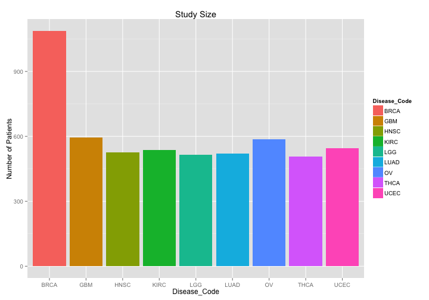

# Exploring the TCGA data in BigQuery

The ISB-CGC (isb-cgc.org) project has aggregated and curated all of the TCGA open-access clinical, biospecimen, and Level-3 molecular data and uploaded it into BigQuery tables that are open to the public.  Here we will show you how you can begin to work with these tables from the familiar R environment.

### Helpful BigQuery links

For this example, we'll also be working with [Google BigQuery](https://cloud.google.com/bigquery/). It's often helpful to have a [link to the docs](https://cloud.google.com/bigquery/what-is-bigquery) handy, and especially the [query reference](https://cloud.google.com/bigquery/query-reference).

## Run a query from R

We will start by loading four R packages:
- the [bigrquery](https://github.com/hadley/bigrquery) package written by Hadley Wickham implements an R interface to [Google BigQuery](https://cloud.google.com/bigquery/),
- the [dplyr](https://github.com/hadley/dplyr) package provides a set of tools for efficiently manipulating datasets in R, and
- the [ggplot2](https://github.com/hadley/ggplot2) package for elegant graphics, and
- the [scales](https://github.com/hadley/scales) package for visualization-oriented scale functions.


```r
require(dplyr) || install.packages("dplyr")
```

```
## [1] TRUE
```

```r
require(bigrquery) || install.packages("bigrquery")
```

```
## [1] TRUE
```

```r
require(scales) || install.packages("scales")
```

```
## [1] TRUE
```

```r
require(ggplot2) || install.packages("ggplot2")
```

```
## [1] TRUE
```

```r
library(ISBCGCExamples)
```


```r
######################[ TIP ]########################################
## Set the Google Cloud Platform project id under which these queries will run.
##
## If you are using the Google Bioconductor workshop docker image, this is already
## set for you in your .Rprofile and you can skip this step.

# project <- "YOUR-PROJECT-ID"
#####################################################################
```

Let's start by working with one of the simplest tables, the Clinical_data table.  The format of a table name in BigQuery is <project_name>:<dataset_name>.<table_name>


```r
theTable <- "isb-cgc:tcga_201510_alpha.Clinical_data"
```

Note that when you send the first query, you will need to go through the authentication flow with BigQuery.  You will be provided with a url to cut and  paste into your browser, and then you will get an authorization code to cut and paste back here.

[bigrquery](https://github.com/hadley/bigrquery) uses the package [httr](https://github.com/hadley/httr) to perform OAuth.

Let's start by just counting the number of records in the table.
First we'll just create the query string and echo it:

```r
querySql <- paste("SELECT COUNT(1) FROM [", theTable, "]", sep="")
querySql
```

```
## [1] "SELECT COUNT(1) FROM [isb-cgc:tcga_201510_alpha.Clinical_data]"
```

And then we'll send the query to the cloud for execution:

```r
result <- query_exec(querySql, project=project)
result
```

```
##     f0_
## 1 11152
```

And we see that the table has 1 row - this is the number of unique patients or participants across all of the various TCGA studies.


```r
######################[ TIP ]########################################
## If you have any trouble with OAuth and need to redo/reset OAuth,
## run the following code.

#if (FALSE != getOption("httr_oauth_cache")) {
#  file.remove(getOption("httr_oauth_cache"))
#}

## or maybe it should look like this?

#if (!is.null(getOption("httr_oauth_cache"))) {
#  file.remove(getOption("httr_oauth_cache"))
#}

#message("Restart R to redo/reset OAuth.")
#####################################################################
```


## Run a query using the BigQuery Web User Interface

So what is actually in this table?  Click on [this link](https://bigquery.cloud.google.com/table/isb-cgc:tcga_201507_alpha.Clinical_data) to view the schema in the BigQuery web user interface.

We can also run the exact same query using the BigQuery web user interface.  In the BigQuery web user interface:

 (1) click on the *"Compose Query"* button
 (2) paste in the SQL for the query we just ran via R
 (3) click on *"Run Query"*.

## Run a query stored in a file from R

Instead of typing SQL directly into our R code, we can use a convenience function to read SQL from a file.

```r
library(ISBCGCExamples)
DisplayAndDispatchQuery
```

```
## function (queryUri, project, replacements = list()) 
## {
##     if (missing(queryUri)) {
##         stop("Pass the file path or url to the file containing the query.")
##     }
##     if (missing(project)) {
##         stop("Pass the project id of your Google Cloud Platform project.")
##     }
##     if (grepl("^https.*", queryUri)) {
##         querySql <- RCurl::getURL(queryUri, ssl.verifypeer = FALSE)
##     }
##     else {
##         querySql <- readChar(queryUri, nchars = 1e+06)
##     }
##     for (replacement in names(replacements)) {
##         querySql <- gsub(replacement, replacements[[replacement]], 
##             querySql, fixed = TRUE)
##     }
##     cat(querySql)
##     bigrquery::query_exec(querySql, project)
## }
## <environment: namespace:ISBCGCExamples>
```

This allows queries to be more easily shared among analyses and also reused for different tables.  For example, in the following file we have a query that will count the number of patients, grouped by disease type in any of our TCGA data tables.

```r
file.show(file.path(system.file(package = "ISBCGCExamples"),
                    "sql",
                    "count-patients-by-study.sql"))
```

Now let's run the query to see what these counts are in the Clinical_data table:

```r
result <- DisplayAndDispatchQuery(file.path(system.file(package = "ISBCGCExamples"),
                                            "sql",
                                            "count-patients-by-study.sql"),
                                  project=project,
                                  replacements=list("_THE_TABLE_"=theTable))
```

```
# all of the TCGA molecular data tables contain the fields ParticipantBarcode and Study

SELECT Study, COUNT(*) AS n
FROM (
    SELECT ParticipantBarcode, Study
    FROM [isb-cgc:tcga_201510_alpha.Clinical_data]
    GROUP BY ParticipantBarcode, Study
) GROUP BY Study
ORDER BY n DESC
```

```r
cat("Number of rows returned by this query: ", nrow(result), "\n")
```

```
Number of rows returned by this query:  33 
```

Results from [bigrquery](https://github.com/hadley/bigrquery) are returned as R dataframes, meaning that we can make use of all of the regular dataframe functions as well as all sorts of other great R packages to do our downstream work.

```r
mode(result)
```

```
## [1] "list"
```

```r
class(result)
```

```
## [1] "data.frame"
```

```r
summary(result)
```

```
##     Study                 n         
##  Length:33          Min.   :  36.0  
##  Class :character   1st Qu.: 134.0  
##  Mode  :character   Median : 308.0  
##                     Mean   : 337.9  
##                     3rd Qu.: 507.0  
##                     Max.   :1097.0
```

```r
head(result)
```

```
##   Study    n
## 1  BRCA 1097
## 2   GBM  596
## 3    OV  587
## 4  UCEC  548
## 5  KIRC  537
## 6  HNSC  528
```

## Visualize Query Results

Since there are over 30 distinct tumor types within the TCGA project, we may want to filter our results before visualizing.  For example let's look only at tumor types with at least 500 patients in the study:


```r
subsetResults <- filter(result, n>=500)
subsetResults <- arrange(subsetResults,desc(n))
```

and then create a barchart of the patient counts:


```r
ggplot(subsetResults, aes(x=Study, y=n, fill=Study)) +
  geom_bar(stat="identity") +
  ylab("Number of Patients") +
  ggtitle("Study Size")
```



## Provenance

```r
sessionInfo()
```

```
R version 3.2.4 (2016-03-10)
Platform: x86_64-apple-darwin13.4.0 (64-bit)
Running under: OS X 10.11.4 (El Capitan)

locale:
[1] en_US.UTF-8/en_US.UTF-8/en_US.UTF-8/C/en_US.UTF-8/en_US.UTF-8

attached base packages:
[1] stats     graphics  grDevices utils     datasets  methods   base     

other attached packages:
[1] ISBCGCExamples_0.1.1 ggplot2_2.1.0        scales_0.4.0        
[4] bigrquery_0.2.0      dplyr_0.4.3          knitr_1.12.3        

loaded via a namespace (and not attached):
 [1] Rcpp_0.12.4      magrittr_1.5     munsell_0.4.3    colorspace_1.2-6
 [5] R6_2.1.2         stringr_1.0.0    httr_1.1.0       plyr_1.8.3      
 [9] tools_3.2.4      parallel_3.2.4   grid_3.2.4       gtable_0.2.0    
[13] DBI_0.3.1        openssl_0.9.2    lazyeval_0.1.10  assertthat_0.1  
[17] digest_0.6.9     formatR_1.3      curl_0.9.6       evaluate_0.8.3  
[21] labeling_0.3     stringi_1.0-1    jsonlite_0.9.19 
```
