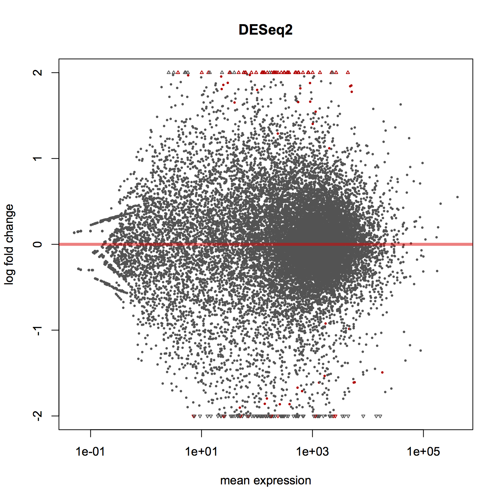

This short tutorial will show you how to reprocess raw TCGA data. We will be using the ISBCGCExamples library to facilitate the file location and transfer.

```{r}
library(ISBCGCExamples)
```

Let's suppose you've already created a cohort using the web-app or "save_cohorts" R function. Earlier I created a cohort of all TCGA samples from brain tissue. I'll use the cohort functions to wrangle that data.

DESeq2 requires raw count data. To get that, we need Level 3 gene expression files.

```{r}
mytoken <- isb_init()       # get authorized

mycohorts <- list_cohorts(mytoken) # get my list of cohorts

mycohorts$count             # number of cohorts I've saved (3)
mycohorts$items[[2]]$name   # name of the cohort
mycohorts$items[[2]]$id     # ID number of the cohort.
```

One of the first things we might need is a list of the sample barcodes for the cohort.

```{r}
barcodes  <- barcodes_from_cohort("69", mytoken)
barcodes$sample_count # number of samples available
```

barcodes is a list with both sample and patient barcodes. Let's take a sample of patients, get the clinical data, and parse out the data file locations.

```{r}
# create a list of patient information
clinList <- vector("list", length(barcodes$patients))

# for each barcode, get the patient details.
clinList <- sapply(barcodes$patients, function(x) patient_details(patient_barcode=x))

# now we'll name the clinical list and take a look at the components of the list.
names(clinList)[i] <- barcodes$patients
names(clinList[[1]])
```

Each element of clinList is itself a list, with clinical data, aliquots, and sample barcodes.
Let's create a clinical information data.frame, which will become our design matrix.

```{r}
clinData <- lapply(clinList, function(a) a$clinical_data)
clinData <- clinData[lapply(clinData, length) > 0]
clinDF <- as.data.frame(matrix(unlist(clinData), ncol=length(clinData[[1]]), byrow=T))
colnames(clinDF) <- names(clinData[[1]])

# can get the patient barcodes in this column:
clinDF$ParticipantBarcode
```

Now we have a data.frame of clinical data. Let's download the sample data, and pair that with clinical.
First we'll collect the sample barcodes. Multiple samples can be associated with a given patient. But
the number of platforms can be different for each sample. Ideally, we would like to choose
the sample with the greatest amount data, or the data type we're interested in.

```{r}
sample_barcodes <- unlist(lapply(clinList, function(a) a$samples))
sampList <- sapply(sample_barcodes, function(x) sample_details(x))
```

I'm interested in this platform: IlluminaHiSeq_RNASeqV2.
So we're going to traverse the data structure and pull out file locations if
we find what we're looking for.

```{r}

sampleDF <- data.frame(SampleBarcode=character(), Patient=character(), Platform=character(), Level=character(), CloudStoragePath=character())

# for each sample in the list
for (i in 1:length(sampList)) {

  # get patient barcode and the data details
  patient <- sampList[[i]]$patient
  data_details <- sampList[[i]]$data_details

  # if the sample actually *has* data associated with it
  if (class(data_details) == "list" & length(data_details) > 1) {

    # then process the list of data, searching for our desired platform and level  
    for (j in 1:length(data_details)) {
      this_barcode <- data_details[[j]]$SampleBarcode
      platform <- data_details[[j]]$Platform
      level    <- data_details[[j]]$DataLevel
      cloudpath <- data_details[[j]]$CloudStoragePath

      # this is it!
      if (platform == "IlluminaHiSeq_RNASeqV2" & level == "Level 3") {
        sampleDF <- rbind(sampleDF, data.frame(SampleBarcode=this_barcode,
          Patient=patient, Platform=platform, Level=level, CloudStoragePath=cloudpath))
        }
      } # end_j
  } # endif
}
```

Great, now we have a data frame of gene expression files, that we can match to our clinical data.
DESeq2 needs raw counts. That data is found in files with suffix "rsem.genes.results".


```{r}
dataSet <- filter(sampleDF, str_detect(CloudStoragePath, "rsem.genes.results"))
clinSet <- filter(clinDF, ParticipantBarcode %in% dataSet$Patient)
smallClinSet <- select(clinSet, ParticipantBarcode, race, gender, age_at_initial_pathologic_diagnosis, days_to_birth, vital_status)
dataSet <- dataSet[,-11]  # going to take one sample for this patient
```

Now we need to acquire the data. We can do that using "gsutil". I'm going to do
it from R, but one could just as easily (or more easily?) do this on the command line.

```{r}
# first I'm going to make a directory to put the data in.
system2(command="mkdir", args="data", wait=T)

# then for each item in our data set, down load the file
for (i in 1:nrow(dataSet)) {
  system(paste0("gsutil cp ", dataSet$CloudStoragePath[i], " data"), wait=T)
}
```

We are going to get the second column, raw_counts, from each file and bind that with the first
column, listing the genes.

```{r}
#to cut the second column from each file.
system("find data/*.rsem.genes.results | xargs -I{} sh -c \"cut -f 2 '{}' > '{}.out'\"")
# get the gene names
system("find data/*.rsem.genes.results | head -n 1 | xargs -I{} sh -c \"cut -f 1 '{}' > '{}.genenames'\"")
# then to paste them all together
system("paste data/*.genenames data/*.out > raw_counts.txt")
# and get the order of the files.
system("find data/*.rsem.genes.results > data.files.txt")
```

Now we have a bunch of files that we need to link up to the clinical data.

```{r}
# our table of file names, after parsing out the raw counts
fnames <- read.table("data.files.txt", stringsAsFactors=F)

# make sure we're dealing with character vectors, not factors!
sampleDF$SampleBarcode <- as.character(sampleDF$SampleBarcode)
sampleDF$Patient       <- as.character(sampleDF$Patient)

# getting the sample barcodes and patient barcodes matching the files
barcodeColumnNames  <- vector("character", nrow(fnames))
patientBarcodeNames <- vector("character", nrow(fnames))

# for each file, we parse out the file ID, and match it to what's in our sample data.frame
for (i in 1:nrow(fnames)) {
  fileid <- str_sub(fnames[i,1], start=6, end=75)
  samplematch <- filter(sampleDF, str_detect(CloudStoragePath, fileid))
  barcodeColumnNames[i] <- samplematch$SampleBarcode
  patientBarcodeNames[i] <- samplematch$Patient
}

# Here we choose the condition of interest. This is probably not the best choice,
# but the classes are at least fairly balanced across files.
# This puts the clincal data in the same order as the file table
cond = as.character(smallClinSet$gender[match(table=smallClinSet$ParticipantBarcode, x=patientBarcodeNames)])

# create the data frame for DESeq2
sampleTable <- as.data.frame(cbind(sampleName=barcodeColumnNames, condition=cond))
```

Finally, we can read in the raw counts, load up DESeq2, and build the data
structure using our raw reads, and test for differential expression.

```{r}
directory<-'.'
source('http://bioconductor.org/biocLite.R')
biocLite('DESeq2')
library(DESeq2)

# preparing the matrix of raw counts
raw <- read.table("raw_counts.txt", sep="\t", header=T, stringsAsFactors=F)
colnames(raw)[2:ncol(raw)] <- barcodeColumnNames
rownames(raw) <- raw$gene_id
raw <- raw[,-1]

# some of the values are fractional ???
rawInt <- apply(raw, 2, as.integer)
rownames(rawInt) <- rownames(raw)

# The main object
dds <- DESeqDataSetFromMatrix(countData = rawInt, colData = sampleTable, design = ~ condition)

# compute DE
dds <- DESeq(dds)

# create the results table
res <- results(dds)

# order by significance.
resOrdered <- res[order(res$padj),]

# make a plot of the differentially expressed genes.
plotMA(res, main="DESeq2", ylim=c(-2,2))
```


So, to recap, using a predefined cohort, we gathered the sample and patient barcodes, the clincial information (which was transformed into a data.frame),
gathered the sample data, parsed out the appropriate file paths, downloaded the file set, parsed out the raw data, and ran DESeq2.

Improvements might include using GCSFuse to mount the buckets, and parsing out the raw counts without downloading the entire file.
