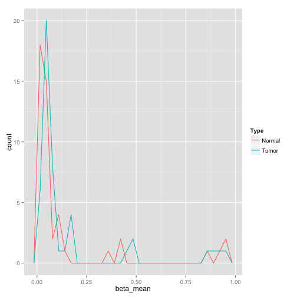
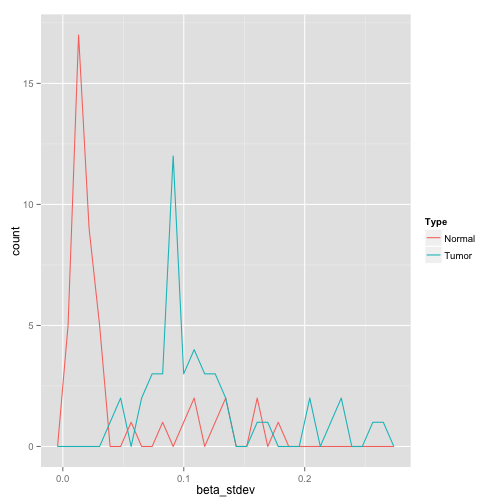

# DNA Methylation (JHU-USC beta values)
The goal of this notebook is to introduce you to the DNA methylation BigQuery table.

This table contains all available TCGA Level-3 DNA methylation data produced by the JHU-USC methylation pipeline using the Illumina Infinium Human Methylation 27k and 450k platforms, as of October 2015. (Actual archive dates range from October 2012 to August 2015.) The most recent archives (eg jhu-usc.edu_HNSC.HumanMethylation450.Level_3.18.8.0) for each of the 33 tumor types were downloaded from the DCC, and data extracted from all files matching the pattern jhu-usc.edu_%.HumanMethylation%.lvl-3.%.txt. Each of these text files has five columns. The first two columns contain the CpG probe id and the methylation beta value. The additional columns contain annotation information (gene symbol(s), and chromosome and genomic coordinate for the CpG probe). Only the CpG probe id and the beta value were extracted during ETL and stored in this BigQuery table, along with the aliquot ID (which can be found both in the text filename, and in the SDRF file in the mage-tab archive).

WARNING: This BigQuery table contains almost 4 billion rows of data and is over 400 GB in size. When experimenting with new queries, be sure to put a "LIMIT" on the results to avoid accidentally launching a query that might either take a very very long time or produce a very large results table!

In order to work with BigQuery, you need to import the bigrquery library and you need to know the name(s) of the table(s) you are going to be working with:


```r
methTable <- "[isb-cgc:tcga_201510_alpha.DNA_Methylation_betas]"
```

From now on, we will refer to this table using this variable methTable, but we could just as well explicitly give the table name each time.
Let's start by taking a look at the table schema:


```r
querySql <- paste("SELECT * FROM ",methTable," limit 1", sep="")
result <- query_exec(querySql, project=project)
data.frame(Columns=colnames(result))
```

```
##                Columns
## 1   ParticipantBarcode
## 2        SampleBarcode
## 3 SampleTypeLetterCode
## 4       AliquotBarcode
## 5             Platform
## 6                Study
## 7             Probe_Id
## 8           Beta_Value
```

Let's count up the number of unique patients, samples and aliquots mentioned in this table. Using the same approach, we can count up the number of unique CpG probes. We will do this by defining a very simple parameterized query. (Note that when using a variable for the table name in the FROM clause, you should not also use the square brackets that you usually would if you were specifying the table name as a string.)


```r
for (x in c("ParticipantBarcode", "SampleBarcode", "AliquotBarcode", "Probe_Id")) {
  querySql <- paste("SELECT COUNT(DISTINCT(",x,"), 25000) AS n ",
                    "FROM ",methTable)
  result <- query_exec(querySql, project=project)
  cat(x, ": ", result[[1]], "\n")
}
```

```
## ParticipantBarcode :  10852 
## SampleBarcode :  12024 
## AliquotBarcode :  12069 
## Probe_Id :  394296
```

As mentioned above, two different platforms were used to measure DNA methylation. The annotations from Illumina are also available in a BigQuery table:


```r
methRef <- '[isb-cgc:platform_reference.methylation_annotation]'
querySql <- paste("SELECT * FROM ",methRef," limit 1", sep="")
result <- query_exec(querySql, project=project)
data.frame(Columns=colnames(result))
```

```
##                        Columns
## 1                  AddressA_ID
## 2                  AddressB_ID
## 3             AlleleA_ProbeSeq
## 4             AlleleB_ProbeSeq
## 5                          CHR
## 6                Chromosome_36
## 7                Color_Channel
## 8                Coordinate_36
## 9                          DHS
## 10                         DMR
## 11                    Enhancer
## 12            Forward_Sequence
## 13                Genome_Build
## 14                  HMM_Island
## 15                      IlmnID
## 16        Infinium_Design_Type
## 17                     MAPINFO
## 18               Methyl27_Loci
## 19                        Name
## 20                   Next_Base
## 21                     Phantom
## 22                  Probe_SNPs
## 23               Probe_SNPs_10
## 24                 Random_Loci
## 25    Regulatory_Feature_Group
## 26     Regulatory_Feature_Name
## 27 Relation_to_UCSC_CpG_Island
## 28                   SourceSeq
## 29                      Strand
## 30       UCSC_CpG_Islands_Name
## 31          UCSC_RefGene_Group
## 32      UCSC_RefGene_Accession
## 33           UCSC_RefGene_Name
```

Given the coordinates for a gene of interest, we can find the associated methylation probes.


```r
geneChr   = "\'3\'"
geneStart = 37034841 - 2500
geneStop  = 37092337 + 2500

querySql <- paste("
SELECT
  IlmnID, Methyl27_Loci, CHR, MAPINFO
FROM
  ",methRef,"
WHERE
  ( CHR=",geneChr,"
    AND ( MAPINFO> ", geneStart," AND MAPINFO< ", geneStop, ") )
ORDER BY
  Methyl27_Loci DESC,
  MAPINFO ASC", sep="")

mlh1Probes = query_exec(querySql, project=project)
mlh1Probes
```

```
##          IlmnID Methyl27_Loci CHR  MAPINFO
## 1    cg24607398          TRUE   3 37033625
## 2    cg10990993          TRUE   3 37033632
## 3    cg18320188          TRUE   3 37033980
## 4    cg02279071          TRUE   3 37034154
## 5    cg00893636          TRUE   3 37034840
## 6    cg13846866          TRUE   3 37035399
## 7    cg02103401         FALSE   3 37033373
## 8    cg04726821         FALSE   3 37033791
## 9    cg11291081         FALSE   3 37033894
## 10   cg05670953         FALSE   3 37033903
## 11   cg04841293         FALSE   3 37034028
## 12   cg05845319         FALSE   3 37034066
## 13   cg21109167         FALSE   3 37034084
## 14   cg03901257         FALSE   3 37034142
## 15   cg14751544         FALSE   3 37034166
## 16   cg16764580         FALSE   3 37034346
## 17   cg01302270         FALSE   3 37034441
## 18   cg17641046         FALSE   3 37034473
## 19   cg07101782         FALSE   3 37034495
## 20   cg03497419         FALSE   3 37034654
## 21   cg27586588         FALSE   3 37034661
## 22   cg16433211         FALSE   3 37034693
## 23   cg10769891         FALSE   3 37034730
## 24   cg19132762         FALSE   3 37034739
## 25   cg23658326         FALSE   3 37034787
## 26   cg11600697         FALSE   3 37034814
## 27   cg21490561         FALSE   3 37034825
## 28   cg03192963         FALSE   3 37034909
## 29   cg06791151         FALSE   3 37034956
## 30   cg07064226         FALSE   3 37034997
## 31   cg06108510         FALSE   3 37035063
## 32   cg24985459         FALSE   3 37035090
## 33   cg12790037         FALSE   3 37035117
## 34   cg25202636         FALSE   3 37035158
## 35   cg17621259         FALSE   3 37035168
## 36   cg14671526         FALSE   3 37035200
## 37   cg05906740         FALSE   3 37035205
## 38   cg27331401         FALSE   3 37035207
## 39   cg25837710         FALSE   3 37035220
## 40   cg12851504         FALSE   3 37035222
## 41   cg06590608         FALSE   3 37035228
## 42   cg11224603         FALSE   3 37035282
## 43   cg19208331         FALSE   3 37035345
## 44   cg14598950         FALSE   3 37035355
## 45   cg04777024         FALSE   3 37036726
## 46   cg17024523         FALSE   3 37038591
## 47 ch.3.753362R         FALSE   3 37048044
## 48   cg25212762         FALSE   3 37055414
## 49   cg11363877         FALSE   3 37082315
## 50   cg03405026         FALSE   3 37082380
## 51   cg16863190         FALSE   3 37092193
```

There are a total of 50 methlyation probes in and near the MLH1 gene, although only 6 of them are on both the 27k and the 450k versions of the platform.


```r
#write.table(mlh1Probes, sep=",", quote=F, row.names=F, file="mlh1Probes.csv")
```

Then let's use this data to create a new table. To do that, I used my browser to surf over to the bigquery web interface. There, under my project ID, I used the menu to create a new data set. I named the dataset DG after my initials. Then, within that dataset, I used the menu to create a new table using the csv file. After being walked through the process (which includes identifying each column), the table is uploaded and we can query it. I also took the opportunity, while uploading the table, to rename some of the columns (IlmnID -> ProbeID and MAPINFO -> Pos).


```r
buildQuery <- function(sampleType) {
paste("SELECT
  cpg.ProbeID AS Probe_Id,
  cpg.Methyl27 AS Methyl27_Loci,
  cpg.Chr AS Chr,
  cpg.Pos AS Position,
  data.beta_stdev AS beta_stdev,
  data.beta_mean AS beta_mean,
  data.beta_min AS beta_min,
  data.beta_max AS beta_max
FROM (
  SELECT *
  FROM [DG.mlh1Probes]
) AS cpg
JOIN (
  SELECT
    Probe_Id,
    STDDEV(beta_value) beta_stdev,
    AVG(beta_value) beta_mean,
    MIN(beta_value) beta_min,
    MAX(beta_value) beta_max
    FROM [isb-cgc:tcga_201510_alpha.DNA_Methylation_betas]
    WHERE ( SampleTypeLetterCode= \'",sampleType, "\' )
    GROUP BY Probe_Id
) AS data
ON
  cpg.ProbeID = data.Probe_Id
ORDER BY
  Position ASC", sep="")
}

rTP = query_exec(buildQuery("TP"), project=project) # tumor samples
rNT = query_exec(buildQuery("NT"), project=project) # normal tissue samples

rTP$Type <- "Tumor"
rNT$Type <- "Normal"
rdat <- rbind(rTP, rNT)
ggplot(rdat, aes(beta_mean, color=Type))+ geom_freqpoly(aes(group = Type))
```

```
## stat_bin: binwidth defaulted to range/30. Use 'binwidth = x' to adjust this.
```

 

```r
ggplot(rdat, aes(beta_stdev, color=Type))+ geom_freqpoly(aes(group = Type))
```

```
## stat_bin: binwidth defaulted to range/30. Use 'binwidth = x' to adjust this.
```

 

From this figure, we can see that, with the exception of the CpG probes near the 3' end of MLH1, the primary tumor samples have a slightly higher average methylation, with significantly greater variability.
