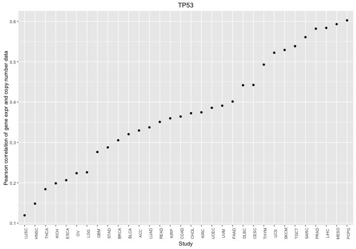
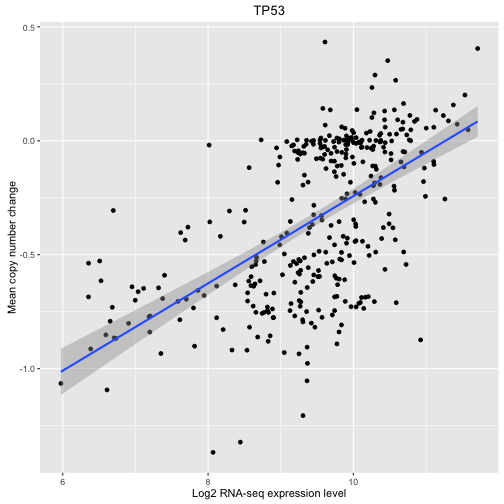

# Expression and Copy Number Correlation

In this example, we will look at the correlation between mRNAseq-based gene expression and copy number data.  We will do this using two data tables from the isb-cgc:tcga_201510_alpha dataset and a genome table from the isb-cgc:genome_reference dataset.


```r
library(dplyr)
library(bigrquery)
library(ggplot2)
library(stringr)
library(ISBCGCExamples)

# The directory in which the files containing SQL reside.
#sqlDir = file.path("/PATH/TO/GIT/CLONE/OF/examples-R/inst/",
sqlDir = file.path(system.file(package = "ISBCGCExamples"), "sql")
```


```r
######################[ TIP ]########################################
## Set the Google Cloud Platform project id under which these queries will run.
##
## If you are using the workshop docker image, this is already
## set for you in your .Rprofile and you can skip this step.

# project = "YOUR-PROJECT-ID"
#####################################################################
```

## Getting gene information

We're going to use the genome data set to query some information about
a given gene.


```r
q <- "select
         seqname,
         MIN(start) as start,
         MAX(end) as end,
         gene_name
      from
         [isb-cgc:genome_reference.GENCODE_v19]
      where
         gene_name = 'TP53'
      group by
         seqname,
         gene_name"

gene_info <- query_exec(q, project)
gene_info
```

```
##   seqname   start     end gene_name
## 1   chr17 7565097 7590856      TP53
```


## Pearson Correlation in BigQuery

This sql example builds a table where for each sample barcode, we have
the RNA-seq level and the mean of copy number changes for segments that
overlap the gene region. Pearson correlation is computed over expr and
copy number columns.


```r
# Set the desired tables to query.
expressionTable = "isb-cgc:tcga_201510_alpha.mRNA_UNC_HiSeq_RSEM"
copyNumberTable = "isb-cgc:tcga_201510_alpha.Copy_Number_segments"

# Now we are ready to run the query.
result = DisplayAndDispatchQuery(
     file.path(sqlDir, "copy_number_and_expr_corr.sql"),
               project=project,
               replacements=list("_STUDY_"="BRCA",
                                 "_EXPRESSION_TABLE_"=expressionTable,
                                 "_COPY_NUMBER_TABLE_"=copyNumberTable,
                                 "_GENE_"=gene_info$gene_name,
                                 "_TP_"="TP",
                                 "_CHR_"=str_sub(gene_info$seqname, start=4),
                                 "_START_"=gene_info$start,
                                 "_END_"=gene_info$end))
```

```

SELECT
  expr.Study as Study,
  expr.HGNC_gene_symbol as Gene,
  CORR(log2(expr.normalized_count+1), cn.mean_segment_mean) as correlation
FROM
  [isb-cgc:tcga_201510_alpha.mRNA_UNC_HiSeq_RSEM] AS expr
JOIN (
  SELECT
    Study,
    SampleBarcode,
    Num_Probes,
    AVG(Segment_Mean) AS mean_segment_mean,
  FROM
    [isb-cgc:tcga_201510_alpha.Copy_Number_segments]
  WHERE
    SampleTypeLetterCode = 'TP'
    AND Chromosome = '17'
    AND ((start <= 7565097 AND END >= 7590856)
      OR (start >= 7565097 AND start <= 7590856)
      OR (END >= 7565097   AND END <= 7590856)
      OR (start >= 7565097 AND END <= 7590856))
  GROUP BY
    Study,
    SampleBarcode,
    Num_Probes ) AS cn
ON
  expr.SampleBarcode = cn.SampleBarcode
  AND expr.Study = cn.Study
WHERE
  expr.HGNC_gene_symbol = 'TP53'
  AND expr.Study = 'BRCA'
GROUP BY
  Study,
  Gene
ORDER BY
  correlation
```

```r
result
```

```
  Study Gene correlation
1  BRCA TP53   0.3053237
```

The result is a table with the study, gene, and pearson correlation for
expression with mean of copy number segments overlapping the gene of interest.

But now we can run it over all studies.


```r
# Now we are ready to run the query.
result = DisplayAndDispatchQuery(
     file.path(sqlDir, "copy_number_and_expr_corr_all_studies.sql"),
               project=project,
               replacements=list("_EXPRESSION_TABLE_"=expressionTable,
                                 "_COPY_NUMBER_TABLE_"=copyNumberTable,
                                 "_GENE_"=gene_info$gene_name,
                                 "_TP_"="TP",
                                 "_CHR_"=str_sub(gene_info$seqname, start=4),
                                 "_START_"=gene_info$start,
                                 "_END_"=gene_info$end))
```

```
## SELECT
##   expr.Study as Study,
##   expr.HGNC_gene_symbol as Gene,
##   CORR(log2(expr.normalized_count+1), cn.mean_segment_mean) as correlation
## FROM
##   [isb-cgc:tcga_201510_alpha.mRNA_UNC_HiSeq_RSEM] AS expr
## JOIN (
##   SELECT
##     Study,
##     SampleBarcode,
##     Num_Probes,
##     AVG(Segment_Mean) AS mean_segment_mean,
##   FROM
##     [isb-cgc:tcga_201510_alpha.Copy_Number_segments]
##   WHERE
##     SampleTypeLetterCode = 'TP'
##     AND Chromosome = '17'
##     AND ((start <= 7565097 AND END >= 7590856)
##       OR (start >= 7565097 AND start <= 7590856)
##       OR (END >= 7565097   AND END <= 7590856)
##       OR (start >= 7565097 AND END <= 7590856))
##   GROUP BY
##     Study,
##     SampleBarcode,
##     Num_Probes ) AS cn
## ON
##   expr.SampleBarcode = cn.SampleBarcode
##   AND expr.Study = cn.Study
## WHERE
##   expr.HGNC_gene_symbol = 'TP53'
## GROUP BY
##   Study,
##   Gene
## ORDER BY
##   correlation
```

```r
result
```

```
##    Study Gene correlation
## 1   LUSC TP53   0.1193299
## 2   HNSC TP53   0.1483263
## 3   THCA TP53   0.1842087
## 4   KICH TP53   0.1985945
## 5   ESCA TP53   0.2064320
## 6     OV TP53   0.2237812
## 7    LGG TP53   0.2259375
## 8    GBM TP53   0.2762577
## 9   STAD TP53   0.2876563
## 10  BRCA TP53   0.3053237
## 11  BLCA TP53   0.3203657
## 12   ACC TP53   0.3295563
## 13  LUAD TP53   0.3373264
## 14  READ TP53   0.3508715
## 15  KIRP TP53   0.3597593
## 16  COAD TP53   0.3642031
## 17  CHOL TP53   0.3722740
## 18  KIRC TP53   0.3746402
## 19  UCEC TP53   0.3857859
## 20   UVM TP53   0.3910619
## 21  PAAD TP53   0.4013773
## 22  DLBC TP53   0.4417422
## 23  CESC TP53   0.4424818
## 24  THYM TP53   0.4928354
## 25   UCS TP53   0.5222810
## 26  SKCM TP53   0.5291675
## 27  TGCT TP53   0.5385247
## 28  SARC TP53   0.5608798
## 29  PRAD TP53   0.5819391
## 30  LIHC TP53   0.5838598
## 31  MESO TP53   0.5931288
## 32  PCPG TP53   0.6024819
```


```r
# Plot comparing the CN ~ Expr correlation across studies.
ggplot(result, aes(x=factor(Study, ordered=T, levels=Study), y=correlation)) +
geom_point() +
theme(axis.text.x=element_text(angle=90, size=8)) +
xlab("Study") + ylab("Pearson correlation of gene expr and copy number data") +
ggtitle(gene_info$gene_name)
```



Looks like the MESO has one of the strongest correlations. Let's check the data.


```r
q <- "
SELECT
  expr.Study as Study,
  expr.HGNC_gene_symbol as Gene,
  expr.SampleBarcode as SampleBarcode,
  log2(expr.normalized_count+1) as expr,
  cn.mean_segment_mean as mean_cn
FROM
  [isb-cgc:tcga_201510_alpha.mRNA_UNC_HiSeq_RSEM] AS expr
JOIN (
  SELECT
    Study,
    SampleBarcode,
    Num_Probes,
    AVG(Segment_Mean) AS mean_segment_mean,
  FROM
    [isb-cgc:tcga_201510_alpha.Copy_Number_segments]
  WHERE
    SampleTypeLetterCode = 'TP'
    AND Study = 'LIHC'
    AND Chromosome = '17'
    AND ((start <= 7565097 AND END >= 7590856)
      OR (start >= 7565097 AND start <= 7590856)
      OR (END >= 7565097   AND END <= 7590856)
      OR (start >= 7565097 AND END <= 7590856))
  GROUP BY
    Study,
    SampleBarcode,
    Num_Probes ) AS cn
ON
  expr.SampleBarcode = cn.SampleBarcode
  AND expr.Study = cn.Study
WHERE
  expr.HGNC_gene_symbol = 'TP53'
  AND expr.Study = 'LIHC'
GROUP BY
  Study,
  Gene,
  SampleBarcode,
  expr,
  mean_cn
"

data <- query_exec(q, project)
head(data)
```

```
##   Study Gene    SampleBarcode      expr mean_cn
## 1  LIHC TP53 TCGA-DD-A4NS-01A 10.039070  0.0137
## 2  LIHC TP53 TCGA-DD-A4NK-01A  9.546030 -0.0762
## 3  LIHC TP53 TCGA-GJ-A3OU-01A 10.024997 -0.2271
## 4  LIHC TP53 TCGA-CC-A8HT-01A  9.693517 -0.3713
## 5  LIHC TP53 TCGA-EP-A2KB-01A 11.535877  0.2011
## 6  LIHC TP53 TCGA-2Y-A9H0-01A  9.368493 -0.9768
```

```r
# Plot comparing the CN ~ Expr correlation across studies.
ggplot(data, aes(x=expr, y=mean_cn)) +
geom_point() +
geom_smooth(method="lm") +
xlab("Log2 RNA-seq expression level") + ylab("Mean copy number change") +
ggtitle(gene_info$gene_name)
```




## Provenance

```r
sessionInfo()
```

```
R version 3.2.4 (2016-03-10)
Platform: x86_64-apple-darwin13.4.0 (64-bit)
Running under: OS X 10.11.5 (El Capitan)

locale:
[1] en_US.UTF-8/en_US.UTF-8/en_US.UTF-8/C/en_US.UTF-8/en_US.UTF-8

attached base packages:
[1] stats     graphics  grDevices utils     datasets  methods   base     

other attached packages:
[1] stringr_1.0.0        ggplot2_2.1.0        bigrquery_0.2.0     
[4] dplyr_0.4.3          knitr_1.13           ISBCGCExamples_0.1.1

loaded via a namespace (and not attached):
 [1] Rcpp_0.12.5      assertthat_0.1   plyr_1.8.3       grid_3.2.4      
 [5] R6_2.1.2         jsonlite_0.9.21  gtable_0.2.0     DBI_0.4-1       
 [9] formatR_1.4      magrittr_1.5     scales_0.4.0     evaluate_0.9    
[13] httr_1.1.0       stringi_1.1.1    curl_0.9.7       labeling_0.3    
[17] tools_3.2.4      munsell_0.4.3    parallel_3.2.4   colorspace_1.2-6
[21] openssl_0.9.4   
```
