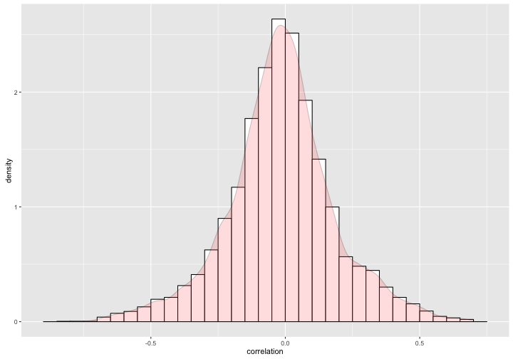
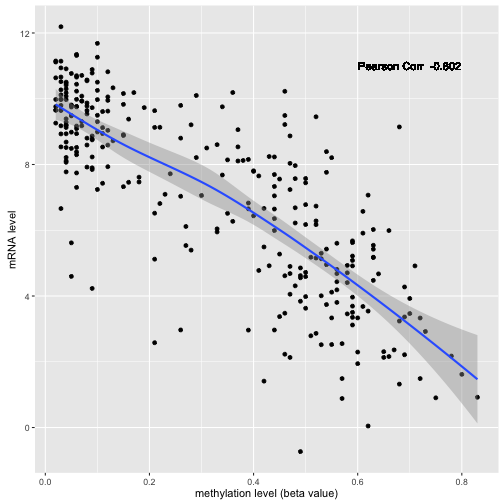

# Expression and Methylation Correlation

In this example, we will look at the correlation between mRNAseq-based gene expression and DNA methylation data.  We will do this using two molecular data tables from the isb-cgc:tcga_201510_alpha dataset and a cohort table from the isb-cgc:tcga_cohorts dataset.

NOTE: I think I will rework and/or eliminate this particular example, but am just going through it now to make sure I understand it and it works as expected.


```r
library(dplyr)
library(bigrquery)
library(scales)
library(ggplot2)
library(ISBCGCExamples)

# The directory in which the files containing SQL reside.
#sqlDir = file.path("/PATH/TO/GIT/CLONE/OF/examples-R/inst/",
sqlDir = file.path(system.file(package = "ISBCGCExamples"),
                   "sql")
```


```r
######################[ TIP ]########################################
## Set the Google Cloud Platform project id under which these queries will run.
##
## If you are using the workshop docker image, this is already
## set for you in your .Rprofile and you can skip this step.

# project = "YOUR-PROJECT-ID"
#####################################################################
```

## Pearson Correlation in BigQuery


```r
# Set the desired tables to query.
expressionTable = "isb-cgc:tcga_201510_alpha.mRNA_UNC_HiSeq_RSEM"
methylationTable = "isb-cgc:tcga_201510_alpha.DNA_Methylation_betas"
# Add any additional clauses to be applied in WHERE to limit the methylation data further.
# (These specific filters are used here just to make the query run faster.  If a query returns
#  very large results, they may need to be handled differently.  This query should take < 20s)
andWhere = "AND SampleTypeLetterCode = 'TP' AND Study = 'CESC' AND CHR = '9'"
# Do not correlate unless there are at least this many observations available:
minNumObs = 30

# Now we are ready to run the query.  (Should return 6110 rows.)
result = DisplayAndDispatchQuery(
     file.path(sqlDir, "expression-methylation-correlation.sql"),
               project=project,
               replacements=list("_EXPRESSION_TABLE_"=expressionTable,
                                 "_METHYLATION_TABLE_"=methylationTable,
                                 "_AND_WHERE_"=andWhere,
                                 "_MINIMUM_NUMBER_OF_OBSERVATIONS_"=minNumObs))
```

```
# Compute the correlation between expression and methylation data.

SELECT
  HGNC_gene_symbol,
  Probe_ID,
  COUNT(DISTINCT(expr.SampleBarcode)) AS num_observations,
  CORR(log2_count, Beta_Value) AS correlation,
FROM (
  # We select the sample-barcode, gene-symbol, gene-expression, probe-id, and beta-value
  # from a "JOIN" of the gene expression data and the methylation data.  Note that we log-
  # transform the expression since the value in the table is a normalized_count value. 
  SELECT
    expr.SampleBarcode,
    HGNC_gene_symbol,
    LOG2(normalized_count+1) AS log2_count,
    Probe_ID,
    Beta_value
  FROM
    [isb-cgc:tcga_201510_alpha.mRNA_UNC_HiSeq_RSEM] AS expr
  JOIN EACH ( FLATTEN ( (
        # We select the sample-barcode, sample-type, study-name, probe-id, beta-value, and gene-symbol
        # from the results of a "JOIN" of the methylation data and the methylation annotation tables
        # which are joined on the CpG probe id that exists in both tables.  Note that we need to 
        # FLATTEN this because the UCSC.RefGene information is a (potentially) repeated field.
        SELECT
          SampleBarcode,
          SampleTypeLetterCode,
          Study,
          Probe_ID,
          Beta_Value,
	        CHR,
          UCSC.RefGene_Name
        FROM
          [isb-cgc:tcga_201510_alpha.DNA_Methylation_betas] AS methData
        JOIN EACH [isb-cgc:platform_reference.methylation_annotation] AS methAnnot
        ON
          methData.Probe_ID = methAnnot.Name
          # We require that the gene-symbol not be null.
        WHERE
          UCSC.RefGene_Name IS NOT NULL
          # Optionally add clause here to limit the query to a particular
          # sample types and/or study and/or chromosome.
          AND SampleTypeLetterCode = 'TP' AND Study = 'CESC' AND CHR = '9'
        ), UCSC.RefGene_Name ) ) AS methyl
  ON
    methyl.UCSC.RefGene_Name = expr.HGNC_gene_symbol
    AND methyl.SampleBarcode = expr.SampleBarcode )
GROUP BY
  HGNC_gene_symbol,
  Probe_ID
HAVING
  num_observations >= 30 AND correlation > -2.
ORDER BY
  correlation ASC
```

```r
cat("Number of rows returned by this query: ", nrow(result), "\n")
```

```
Number of rows returned by this query:  6046 
```

The result is a table with one row for each (gene,CpG-probe) pair for which at least 30 data values exist that meet the requirements in the "andWhere" clause.  The (gene,CpG-probe) pair is defined by a gene symbol and a CpG-probe ID.  In many cases, there may be multiple CpG probes associated with a single gene.


```r
# Most negative correlation should be PHYHD1 cg14299940 n=903, correlation = -0.8018487
head(result)
```

```
##   HGNC_gene_symbol   Probe_ID num_observations correlation
## 1           PHYHD1 cg14299940              301  -0.8018487
## 2            INSL6 cg13504907              301  -0.7800666
## 3            BICD2 cg02929681              301  -0.7252331
## 4             CRAT cg22192879              301  -0.6979521
## 5            BICD2 cg13683626              301  -0.6953693
## 6            BICD2 cg14181777              301  -0.6806368
```


```r
# Histogram overlaid with kernel density curve
ggplot(result, aes(x=correlation)) +
    geom_histogram(aes(y=..density..),      # Histogram with density instead of count on y-axis
                   binwidth=.05,
                   colour="black", fill="white") +
    geom_density(alpha=.2, fill="#FF6666")  # Overlay with transparent density plot
```



## Pearson Correlation in R

Now let's reproduce one of the results directly in R.

### Retrieve Expression Data

First we retrieve the expression data for a particular gene.

```r
# Set the desired gene to query.
gene = "PHYHD1"
andWhere = "AND SampleTypeLetterCode = 'TP' AND Study = 'CESC'"
expressionData = DisplayAndDispatchQuery(file.path(sqlDir, "expression-data.sql"),
                                         project=project,
                                         replacements=list("_EXPRESSION_TABLE_"=expressionTable,
                                                           "_GENE_"=gene,
                                                           "_AND_WHERE_"=andWhere))
```

```
# Retrieve expression data for a particular gene.
SELECT
  SampleBarcode,
  HGNC_gene_symbol,
  normalized_count
FROM [isb-cgc:tcga_201510_alpha.mRNA_UNC_HiSeq_RSEM]
WHERE
  HGNC_gene_symbol = 'PHYHD1'
  AND SampleTypeLetterCode = 'TP' AND Study = 'CESC'
ORDER BY
  SampleBarcode
```

```r
cat("Number of rows returned by this query: ", nrow(expressionData), "\n")
```

```
Number of rows returned by this query:  301 
```


```r
head(expressionData)
```

```
##      SampleBarcode HGNC_gene_symbol normalized_count
## 1 TCGA-2W-A8YY-01A           PHYHD1        1467.8112
## 2 TCGA-4J-AA1J-01A           PHYHD1         632.2085
## 3 TCGA-BI-A0VR-01A           PHYHD1          13.3608
## 4 TCGA-BI-A0VS-01A           PHYHD1         446.1287
## 5 TCGA-BI-A20A-01A           PHYHD1          48.6473
## 6 TCGA-C5-A0TN-01A           PHYHD1          49.1132
```

### Retrieve Methylation Data

Then we retrieve the methylation data for a particular probe.


```r
# Set the desired probe to query.
probe = "cg14299940"
andWhere = "AND SampleTypeLetterCode = 'TP' AND Study = 'CESC'"
methylationData = DisplayAndDispatchQuery(file.path(sqlDir, "methylation-data.sql"),
                                          project=project,
                                          replacements=list("_METHYLATION_TABLE_"=methylationTable,
                                                            "_AND_WHERE_"=andWhere,
                                                            "_PROBE_"=probe))
```

```
# Retrieve methylation data for a particular probe id.
SELECT
  SampleBarcode,
  SampleTypeLetterCode,
  Study,
  Probe_ID,
  Beta_Value
FROM [isb-cgc:tcga_201510_alpha.DNA_Methylation_betas]
WHERE
  Probe_ID = 'cg14299940'
  AND SampleTypeLetterCode = 'TP' AND Study = 'CESC'
ORDER BY
  SampleBarcode,
  SampleTypeLetterCode,
  Study
```

```r
cat("Number of rows returned by this query: ", nrow(methylationData), "\n")
```

```
Number of rows returned by this query:  303 
```


```r
head(methylationData)
```

```
##      SampleBarcode SampleTypeLetterCode Study   Probe_ID Beta_Value
## 1 TCGA-2W-A8YY-01A                   TP  CESC cg14299940       0.03
## 2 TCGA-4J-AA1J-01A                   TP  CESC cg14299940       0.07
## 3 TCGA-BI-A0VR-01A                   TP  CESC cg14299940       0.54
## 4 TCGA-BI-A0VS-01A                   TP  CESC cg14299940       0.08
## 5 TCGA-BI-A20A-01A                   TP  CESC cg14299940       0.56
## 6 TCGA-C5-A0TN-01A                   TP  CESC cg14299940       0.05
```

### Perform the correlation

First we take the inner join of this data:

```r
data = inner_join(expressionData, methylationData)
```

```
## Joining by: "SampleBarcode"
```

```r
head(data)
```

```
##      SampleBarcode HGNC_gene_symbol normalized_count SampleTypeLetterCode
## 1 TCGA-2W-A8YY-01A           PHYHD1        1467.8112                   TP
## 2 TCGA-4J-AA1J-01A           PHYHD1         632.2085                   TP
## 3 TCGA-BI-A0VR-01A           PHYHD1          13.3608                   TP
## 4 TCGA-BI-A0VS-01A           PHYHD1         446.1287                   TP
## 5 TCGA-BI-A20A-01A           PHYHD1          48.6473                   TP
## 6 TCGA-C5-A0TN-01A           PHYHD1          49.1132                   TP
##   Study   Probe_ID Beta_Value
## 1  CESC cg14299940       0.03
## 2  CESC cg14299940       0.07
## 3  CESC cg14299940       0.54
## 4  CESC cg14299940       0.08
## 5  CESC cg14299940       0.56
## 6  CESC cg14299940       0.05
```

And run a pearson correlation on it:

```r
p = round(cor(x=log2(data$normalized_count+1), y=data$Beta_Value, method="pearson"), 3)
qplot(data=data, y=log2(normalized_count), x=Beta_Value, geom=c("point","smooth"),
      xlab="methylation level (beta value)", ylab="mRNA level") +
      geom_text(x = 0.7, y = 11, label = paste("Pearson Corr ", p))
```



```r
p
```

```
## [1] -0.802
```

And we can see that we have reproduced one of our results from BigQuery.
the correlation now is -0.802 on 301 samples...

## Provenance

```r
sessionInfo()
```

```
R version 3.2.4 (2016-03-10)
Platform: x86_64-apple-darwin13.4.0 (64-bit)
Running under: OS X 10.11.4 (El Capitan)

locale:
[1] en_US.UTF-8/en_US.UTF-8/en_US.UTF-8/C/en_US.UTF-8/en_US.UTF-8

attached base packages:
[1] stats     graphics  grDevices utils     datasets  methods   base     

other attached packages:
[1] ISBCGCExamples_0.1.1 ggplot2_2.1.0        scales_0.4.0        
[4] bigrquery_0.2.0      dplyr_0.4.3         

loaded via a namespace (and not attached):
 [1] Rcpp_0.12.4      assertthat_0.1   grid_3.2.4       plyr_1.8.3      
 [5] R6_2.1.2         jsonlite_0.9.19  gtable_0.2.0     DBI_0.3.1       
 [9] formatR_1.3      magrittr_1.5     evaluate_0.8.3   httr_1.1.0      
[13] stringi_1.0-1    curl_0.9.6       labeling_0.3     tools_3.2.4     
[17] stringr_1.0.0    markdown_0.7.7   munsell_0.4.3    parallel_3.2.4  
[21] colorspace_1.2-6 openssl_0.9.2    knitr_1.12.3    
```
