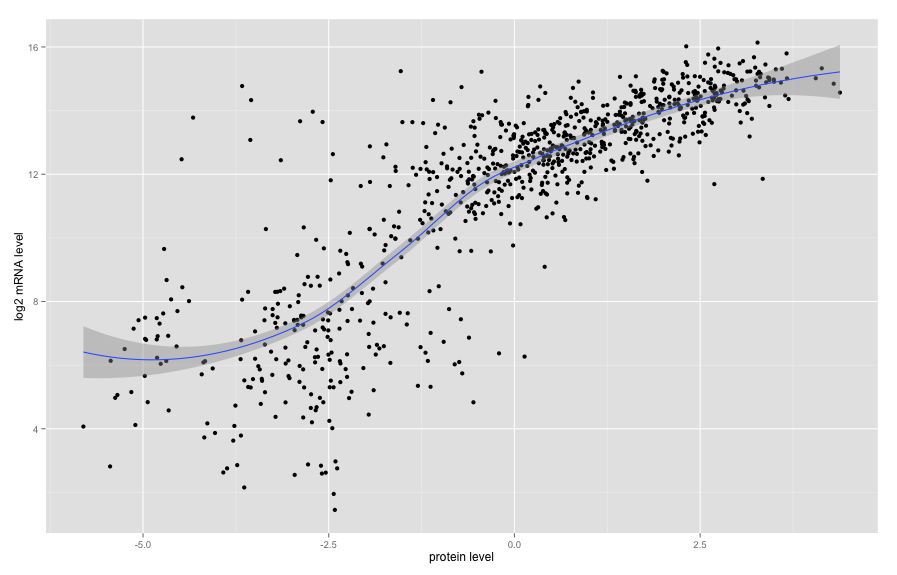

# Expression and Protein Correlation

In this example, we will look at the correlation between mRNAseq-based gene expression data and RPPA-based protein expression data.  We will do this using two molecular data tables from the isb-cgc:tcga_201510_alpha dataset and a cohort table from the isb-cgc:tcga_cohorts dataset.


```r
library(ISBCGCExamples)

# The directory in which the files containing SQL reside.
#sqlDir = file.path("/PATH/TO/GIT/CLONE/OF/examples-R/inst/",
sqlDir = file.path(system.file(package = "ISBCGCExamples"),"sql")
```


```r
######################[ TIP ]########################################
## Set the Google Cloud Platform project id under which these queries will run.
##
## If you are using the workshop docker image, this is already
## set for you in your .Rprofile and you can skip this step.

# project = "YOUR-PROJECT-ID"
#####################################################################
```

## Spearman Correlation in BigQuery

We will start by performing the correlation directly in BigQuery.  We will use a pre-defined SQL query in which key strings will be replaced according to the values specified in the "replacements" list.


```r
# Set the desired tables to query.
expressionTable = "isb-cgc:tcga_201510_alpha.mRNA_UNC_HiSeq_RSEM"
proteinTable = "isb-cgc:tcga_201510_alpha.Protein_RPPA_data"
cohortTable = "isb-cgc:tcga_cohorts.BRCA"

# Do not correlate unless there are at least this many observations available
minimumNumberOfObservations = 30
```

We'll pause for a moment here and have a look at the size of our cohort table:


```r
cohortInfo <- get_table("isb-cgc","tcga_cohorts","BRCA")
cohortInfo$description
```

```
[1] "This BRCA cohort is a curated list of patients and samples from the TCGA BRCA study.  It contains 1088 patients and 2275 samples.  You may join this table with other tables in the isb-cgc:tcga_201507_alpha dataset to perform further analysis on this cohort."
```

```r
cohortInfo$numRows
```

```
[1] "2275"
```

```r
ptm1 <- proc.time()

# Now we are ready to run the query.
result = DisplayAndDispatchQuery (
             file.path(sqlDir, "protein-mrna-spearman-correlation.sql"),
             project=project,
             replacements=list("_EXPRESSION_TABLE_"=expressionTable,
                               "_PROTEIN_TABLE_"=proteinTable,
                               "_COHORT_TABLE_"=cohortTable,
                               "_MINIMUM_NUMBER_OF_OBSERVATIONS_"=minimumNumberOfObservations) )
```

```
# This query performs a Spearman (ranked) correlation between the protein- and the mRNA-expression data
# partitioned based on gene and protein.  The correlation is done by the BigQuery CORR function, but first
# we need to use the RANK function to turn expression values into ranks.

#### QUESTION: should the COUNT(1) be COUNT(2) instead ???

SELECT
  gene,
  protein,
  COUNT(1) AS num_observations,
  CORR(expr_rank, prot_rank) AS spearman_corr
FROM (
  # in order to do a ranke-based (Spearman) correlation, we need to turn the expression values into ranks
  SELECT
    barcode,
    gene,
    protein,
    RANK() OVER (PARTITION BY gene, protein ORDER BY log2_count ASC) AS expr_rank,
    RANK() OVER (PARTITION BY gene, protein ORDER BY protein_expression ASC) AS prot_rank,
  FROM (
    # here we need the sample identifier, the gene symbol, the protein name, and the two expression values
    # that come out of the JOIN defined below
    SELECT
      feat1.SampleBarcode AS barcode,
      Gene_Name AS gene,
      Protein_Name AS protein,
      protein_expression,
      log2_count,
    FROM (
      # on the left side of the JOIN, we SELECT the sample identifier, the gene symbol, the protein name,
      # and the protein expression value, but only for samples that are in our specified "cohort"
      SELECT
        SampleBarcode,
        Gene_Name,
        Protein_Name,
        protein_expression
      FROM
        [isb-cgc:tcga_201510_alpha.Protein_RPPA_data]
      WHERE
        SampleBarcode IN (
        SELECT
          SampleBarcode
        FROM
          [isb-cgc:tcga_cohorts.BRCA] ) ) feat1
    JOIN EACH (
      # on the right side of the JOIN, we SELECT the sample identifier, the gene symbol, and the gene
      # expression value (to which we apply a LOG2() operation), again only for samples in our "cohort"
      SELECT
        SampleBarcode,
        HGNC_gene_symbol,
        LOG2(normalized_count+1) AS log2_count
      FROM
        [isb-cgc:tcga_201510_alpha.mRNA_UNC_HiSeq_RSEM]
      WHERE
        SampleBarcode IN (
        SELECT
          SampleBarcode
        FROM
          [isb-cgc:tcga_cohorts.BRCA] ) ) feat2
    ON
      # the JOIN needs to line up rows where the sample identifier and the gene symbol match
      feat1.SampleBarcode = feat2.SampleBarcode
      AND feat1.Gene_Name = feat2.HGNC_gene_symbol))
GROUP BY
  gene,
  protein
HAVING
  # although we will compute correlations for all genes and proteins, we only want to keep values where
  # the correlation was based on at least 30 observations
  num_observations >= 30
ORDER BY
  # and finally we want to order the ouputs from largest positive correlation, descending to the most negative
  # correlation
  spearman_corr DESC
```

```r
ptm2 <- proc.time() - ptm1
cat("Wall-clock time for BigQuery:",ptm2[3])
```

```
Wall-clock time for BigQuery: 2.377
```
Number of rows returned by this query: `nrow(result)`.

The result is a table with one row for each (gene,protein) pair for which at least 30 data values exist for the specified cohort.  The (gene,protein) pair is defined by a gene symbol and a protein name.  In many cases the gene symbol and the protein name may be identical, but for some genes the RPPA dataset may contain expression values for more than one post-translationally-modified protein product from a particular gene.


```r
head(result)
```

```
##     gene  protein num_observations spearman_corr
## 1   ESR1 ER-alpha              922     0.8552661
## 2   BCL2    Bcl-2              922     0.8022549
## 3  GATA3    GATA3              922     0.7479918
## 4  PREX1   P-REX1              922     0.7412556
## 5   FASN     FASN              922     0.7299020
## 6 IGFBP2   IGFBP2              922     0.7262222
```


```r
library(ggplot2)

# Use ggplot to create a histogram overlaid with a transparent kernel density curve
ggplot(result, aes(x=spearman_corr)) +
     # use 'density' instead of 'count' for the histogram
     geom_histogram(aes(y=..density..),
                   binwidth=.05,
                   colour="black", fill="white") +
     # and overlay with a transparent density plot
     geom_density(alpha=.2, fill="#FF6666") +
     # and add a vertical line at x=0 to emphasize that most correlations are positive
     geom_vline(xintercept=0)
```


## Spearman Correlation in R

Now let's reproduce one of the results directly in R.  The highest correlation value was for the (ESR1,ER-alpha) (gene,protein) pair, so that's the pair that we will use for our validation test.

### Retrieve Expression Data

First we retrieve the mRNA expression data for a specific gene and only for samples in our cohort.

```r
# Set the desired gene to query.
gene = "ESR1"

expressionData = DisplayAndDispatchQuery(file.path(sqlDir, "expression-data-by-cohort.sql"),
                                         project=project,
                                         replacements=list("_EXPRESSION_TABLE_"=expressionTable,
                                                           "_COHORT_TABLE_"=cohortTable,
                                                           "_GENE_"=gene))
```

```
# Retrieve expression data for a particular gene for samples within a cohort.
SELECT
  SampleBarcode,
  HGNC_gene_symbol,
  normalized_count
FROM [isb-cgc:tcga_201510_alpha.mRNA_UNC_HiSeq_RSEM]
WHERE
  HGNC_gene_symbol = 'ESR1'
  AND SampleBarcode IN (
  SELECT
    SampleBarcode
  FROM
    [isb-cgc:tcga_cohorts.BRCA] )
ORDER BY
  SampleBarcode
```
Number of rows returned by this query: `nrow(expressionData)`.


```r
head(expressionData)
```

```
##      SampleBarcode HGNC_gene_symbol normalized_count
## 1 TCGA-3C-AAAU-01A             ESR1        3457.9620
## 2 TCGA-3C-AALI-01A             ESR1          68.5155
## 3 TCGA-3C-AALJ-01A             ESR1        7482.3209
## 4 TCGA-3C-AALK-01A             ESR1        2485.3124
## 5 TCGA-4H-AAAK-01A             ESR1        5518.2979
## 6 TCGA-5L-AAT0-01A             ESR1        6592.1689
```

### Retrieve Protein Data

Next, we retrieve the protein data for a specific (gene,protein) pair, and again only for samples in our cohort.


```r
protein = "ER-alpha"

proteinData = DisplayAndDispatchQuery(file.path(sqlDir, "protein-data-by-cohort.sql"),
                                      project=project,
                                      replacements=list("_PROTEIN_TABLE_"=proteinTable,
                                                        "_COHORT_TABLE_"=cohortTable,
                                                        "_GENE_"=gene,
                                                        "_PROTEIN_"=protein))
```

```
# Retrieve protein data for a particular gene for samples within a cohort.
SELECT
  SampleBarcode,
  Gene_Name,
  Protein_Name,
  protein_expression
FROM
  [isb-cgc:tcga_201510_alpha.Protein_RPPA_data]
WHERE
  Gene_Name = 'ESR1'
  AND Protein_Name = 'ER-alpha'
  AND SampleBarcode IN (
  SELECT
    SampleBarcode
  FROM
    [isb-cgc:tcga_cohorts.BRCA] )
ORDER BY
  SampleBarcode
```
Number of rows returned by this query: `nrow(proteinData)`.


```r
head(proteinData)
```

```
##      SampleBarcode Gene_Name Protein_Name protein_expression
## 1 TCGA-3C-AALI-01A      ESR1     ER-alpha         -0.7433601
## 2 TCGA-3C-AALK-01A      ESR1     ER-alpha          0.0404196
## 3 TCGA-4H-AAAK-01A      ESR1     ER-alpha          1.3058341
## 4 TCGA-5T-A9QA-01A      ESR1     ER-alpha          1.7900436
## 5 TCGA-A1-A0SF-01A      ESR1     ER-alpha          1.1791140
## 6 TCGA-A1-A0SH-01A      ESR1     ER-alpha         -1.5588764
```

Since protein data is not typically available for as many samples as mRNA expression data, the returned "expressionData" table is likely to be quite a bit bigger than the "proteinData" table.  The next step is an inner join of these two tables:


```r
library(dplyr)

data = inner_join(expressionData, proteinData)
```

```
## Joining by: "SampleBarcode"
```

```r
dim(data)
```

```
## [1] 922   6
```

```r
head(arrange(data, normalized_count))
```

```
##      SampleBarcode HGNC_gene_symbol normalized_count Gene_Name
## 1 TCGA-AQ-A54N-01A             ESR1           2.7343      ESR1
## 2 TCGA-A2-A3XV-01A             ESR1           3.8710      ESR1
## 3 TCGA-E2-A158-01A             ESR1           4.4555      ESR1
## 4 TCGA-AN-A0G0-01A             ESR1           5.8621      ESR1
## 5 TCGA-AR-A1AH-01A             ESR1           6.0368      ESR1
## 6 TCGA-AR-A0TP-01A             ESR1           6.1550      ESR1
##   Protein_Name protein_expression
## 1     ER-alpha          -2.417648
## 2     ER-alpha          -2.432641
## 3     ER-alpha          -3.637536
## 4     ER-alpha          -2.958320
## 5     ER-alpha          -2.591913
## 6     ER-alpha          -2.540526
```

The dimension of the resulting table should match the number of observations indicated in our original BigQuery result, and now we perform a Spearman correlation on the two data vectors:


```r
cor(x=data$normalized_count, y=data$protein_expression, method="spearman")
```

```
## [1] 0.8552696
```

```r
qplot(data=data, y=log2(normalized_count), x=protein_expression, geom=c("point","smooth"),
      xlab="protein level", ylab="log2 mRNA level")
```

```
## geom_smooth: method="auto" and size of largest group is <1000, so using loess. Use 'method = x' to change the smoothing method.
```

 

The R-based Spearman correlation matches the BigQuery result.

## Provenance

```r
sessionInfo()
```

```
R version 3.2.1 (2015-06-18)
Platform: x86_64-apple-darwin13.4.0 (64-bit)
Running under: OS X 10.10.5 (Yosemite)

locale:
[1] en_US.UTF-8/en_US.UTF-8/en_US.UTF-8/C/en_US.UTF-8/en_US.UTF-8

attached base packages:
[1] stats     graphics  grDevices utils     datasets  methods   base     

other attached packages:
[1] ISBCGCExamples_0.1 ggplot2_1.0.1      scales_0.3.0      
[4] bigrquery_0.1.0    dplyr_0.4.3       

loaded via a namespace (and not attached):
 [1] Rcpp_0.12.2      knitr_1.11       magrittr_1.5     MASS_7.3-44     
 [5] munsell_0.4.2    colorspace_1.2-6 R6_2.1.1         stringr_1.0.0   
 [9] httr_1.0.0       plyr_1.8.3       tools_3.2.1      parallel_3.2.1  
[13] grid_3.2.1       gtable_0.1.2     DBI_0.3.1        lazyeval_0.1.10
[17] assertthat_0.1   digest_0.6.8     reshape2_1.4.1   formatR_1.2.1   
[21] curl_0.9.3       mime_0.4         evaluate_0.8     labeling_0.3    
[25] stringi_1.0-1    jsonlite_0.9.17  markdown_0.7.7   proto_0.3-10    
```
