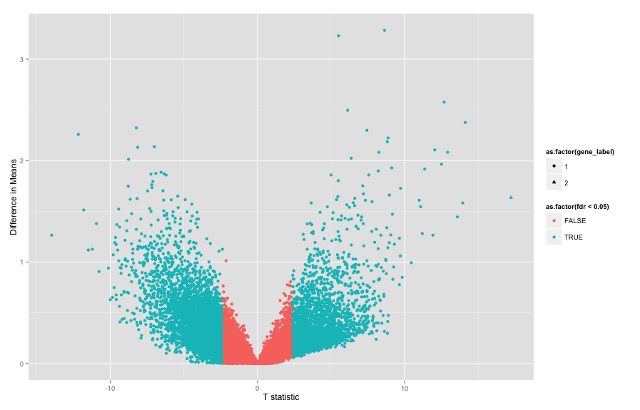
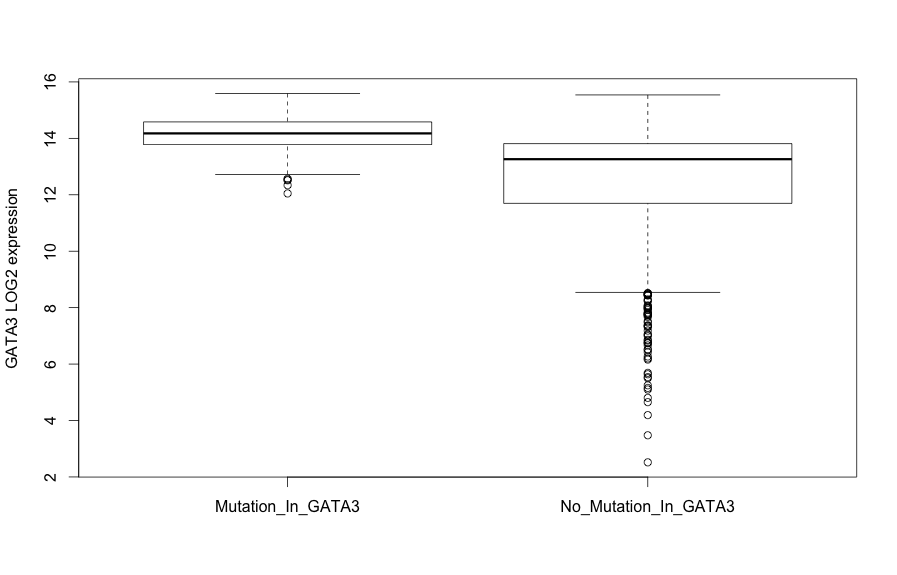

# Defining cohorts and performing differential expression analysis

Differential expression (DE) is a common analysis that determines if the mean
gene expression level differ between two groups. Most often we have two
groups, normal and disease. But, in the case of TCGA, normal tissue samples
are not always available. Nonetheless, samples can be grouped in many different
ways, and with the number of samples and the types of data, one can be quite creative with
analysis. In this work, I will be creating groups of samples based on somatic mutations,
changes in the DNA of tumors, and associating it with differentially expressed genes.


The first question: "what types of mutation data are available?"

```r
project <- 'YOUR PROJECT ID'
```

```r
library(dplyr)
library(bigrquery)
library(scales)
library(ggplot2)
library(ISBCGCExamples)

q <- "SELECT
        Variant_Classification
      FROM
        [isb-cgc:tcga_201510_alpha.Somatic_Mutation_calls]
      WHERE
        Study = 'BRCA'
      GROUP BY
        Variant_Classification"

result <- query_exec(q, project)
result
```

```r
#     Variant_Classification
#1         Nonsense_Mutation
#2              In_Frame_Del
#3     De_novo_Start_InFrame
#4                       RNA
#5               Splice_Site
#6         Missense_Mutation
#7           Frame_Shift_Del
#8           Start_Codon_Ins
#9            Stop_Codon_Ins
#10                      IGR
#11                   Intron
#12                  lincRNA
#13                    3'UTR
#14         Nonstop_Mutation
#15          Start_Codon_Del
#16                   Silent
#17                    5'UTR
#18          Frame_Shift_Ins
#19             In_Frame_Ins
#20           Stop_Codon_Del
#21          Start_Codon_SNP
#22 De_novo_Start_OutOfFrame
```

This query is selecting all the variant classification labels for samples
in the BRCA study using the Somatic Mutation table. The GROUP BY portion of the query
ensures we only get each category once, similar to the DISTINCT keyword.

Oftentimes, people are interested in specific types of variants, such as exonic variants.
Here, I'm interested in whether any type of variant might be associated with
differential expression. In order to perform such an analysis, we
need to define two groups. For now, let's focus on the IL10 gene,
an anti-inflammatory cytokine (signalling molecule) used by the immune system. So
let's find out how many individuals have a mutation in IL10, in the BRCA study.

```r
q <- "SELECT
        ParticipantBarcode
      FROM
        [isb-cgc:tcga_201510_alpha.Somatic_Mutation_calls]
      WHERE
        Hugo_Symbol = 'IL10'
        AND Study = 'BRCA'
      GROUP BY
        ParticipantBarcode"

query_exec(q, project)
```

```r
#NULL
```

NULL? What it means is there's no data for that gene. Maybe we should find out
What genes *do* have somatic mutations in BRCA, and how many samples? That
way we can make a more educated choice.

```r
q <- "SELECT
        COUNT (DISTINCT(pb)) AS sampleN,
        hugosymbols AS gene
      FROM (
        SELECT
            ParticipantBarcode AS pb,
            Hugo_Symbol AS hugosymbols
        FROM
            [isb-cgc:tcga_201510_alpha.Somatic_Mutation_calls]
        WHERE
            Study = 'BRCA'
        GROUP BY
            hugosymbols,
            pb)
      GROUP BY
        gene
      ORDER BY
        sampleN DESC"
genes <- query_exec(q, project)
head(genes)
```

```r
#  sampleN    gene
#1     627 Unknown
#2     335  PIK3CA
#3     334    TP53
#4     206     TTN
#5     123    CDH1
#6     117   GATA3
```

In this query, first on the inside, we are selecting ParticipantBarcodes and gene
symbols, and grouping on those variables. This lets us get one count per gene
per sample. Then from that table generated on the interior of the query, we
count the number of gene symbols, giving us the number of samples with variants
in a particular gene.

OK, so we see that a fair number of variants are not associated with any gene,
and PIK3CA ranks first for the number of samples with mutations in that gene.
Let's check our results on one gene.

```r
q <- "SELECT count(hugosymbols)
        FROM (
          SELECT
            ParticipantBarcode, Hugo_Symbol as hugosymbols
          FROM
            [isb-cgc:tcga_201510_alpha.Somatic_Mutation_calls]
          WHERE
            Hugo_Symbol = 'GATA3'
            and Study = 'BRCA'
          GROUP BY
            ParticipantBarcode,
            hugosymbols )"
query_exec(q, project)
```

```r
#  f0_
#1 117
```

The inner select statement produces a table with a row for each participant.
Then we can count over that table to get the number of participants. This
number matches what we found above. You can see that if the aggregation variable
is not named, it gets a name like "f0_".

Now we need to define our groups, those with a variant in a particular gene,
and those without. Let's build a table of participant barcodes with a variant
in gene GATA3.

First let's get all ParticipantBarcode associated with BRCA.

```r
q <- "
  SELECT
    ParticipantBarcode,
  FROM
    [isb-cgc:tcga_201510_alpha.Somatic_Mutation_calls]
  WHERE
    Study = 'BRCA'
  GROUP BY
    ParticipantBarcode
 "
barcodesBRCA <- query_exec(q, project)
head(barcodesBRCA)
```

```r
#  ParticipantBarcode
#1       TCGA-AN-A041
#2       TCGA-B6-A0WV
#3       TCGA-AN-A0FD
#4       TCGA-C8-A1HL
#5       TCGA-C8-A12M
#6       TCGA-A8-A09R
```

Then, let's get the barcodes for samples with a mutation in GATA3, since it
had a good number of samples according to the gene table we made above
(and I'm interested in immune related genes).

```r
q <- "
  SELECT
    ParticipantBarcode,
  FROM
    [isb-cgc:tcga_201510_alpha.Somatic_Mutation_calls]
  WHERE
    Hugo_Symbol = 'GATA3'
    AND Study = 'BRCA'
  GROUP BY
    ParticipantBarcode
 "
barcodesWithMutations <- query_exec(q, project)
head(barcodesWithMutations)
```

```r
#  ParticipantBarcode
#1       TCGA-AN-A041
#2       TCGA-B6-A0WV
#3       TCGA-AN-A0FD
#4       TCGA-C8-A1HL
#5       TCGA-C8-A12M
#6       TCGA-A8-A09R
```

Next, we get the participant barcodes that do not have mutations in GATA3,
using the following query.

```r
q <- "
SELECT
  ParticipantBarcode
FROM
  [isb-cgc:tcga_201510_alpha.Somatic_Mutation_calls]
WHERE ParticipantBarcode NOT IN (
    SELECT
      ParticipantBarcode,
    FROM
      [isb-cgc:tcga_201510_alpha.Somatic_Mutation_calls]
    WHERE
      Hugo_Symbol = 'GATA3'
      and Study = 'BRCA'
    GROUP BY
      ParticipantBarcode)
  and Study = 'BRCA'
GROUP BY ParticipantBarcode"
barcodesWithOUTMutations <- query_exec(q, project)
sum(barcodesWithMutations$ParticipantBarcode %in% barcodesWithOUTMutations$ParticipantBarcode)
```

```r
#[1] 0  # zero overlap
#[1] 117   1  
```

This gives us 117 samples with a variant in GATA3, 873 samples without a
variant in GATA3, which matches the number of samples in the BRCA study (990).
Let's take a look at what kind of variants are found in GATA3, in case we
would like to eliminate some.

```r
q <- "
  SELECT
    vc,
    count(vc) as num_variants_in_class
  FROM (
    SELECT
      ParticipantBarcode,
      Variant_Classification as vc
    FROM
      [isb-cgc:tcga_201510_alpha.Somatic_Mutation_calls]
    WHERE
      Hugo_Symbol = 'GATA3'
      AND Study = 'BRCA'
    GROUP BY
      ParticipantBarcode,
      vc)
  GROUP BY vc
 "
query_exec(q, project)
```

```r
#                 vc  num_variants_in_class
#1       Splice_Site  24
#2   Frame_Shift_Ins  62
#3   Frame_Shift_Del  19
#4    Stop_Codon_Ins   1
#5            Silent   2
#6 Missense_Mutation  10
#7 Nonsense_Mutation   2
```

So we find that frame shift insertions are the most common type of variant,
followed by splice site variants.

Next, we compute the average gene expression over our defined
cohorts. To do this, we first select the participants with mutations
in GATA3, then in the "exterior" of the query, we select the normalized_count,
which is the gene expression level, for gene GATA3, only for tumor samples
(SampleTypeLetterCode = 'TP'), and only for participants with mutations in
GATA3, as already defined. With the normalized_count, we can use aggregation
functions to compute the mean and standard deviation on the LOG2 of expression.

```r
q <- "
SELECT
  AVG(LOG2(normalized_count+1)) as mean_expr,
  STDDEV(LOG2(normalized_count+1)) as sd_expr
FROM
  [isb-cgc:tcga_201510_alpha.mRNA_UNC_HiSeq_RSEM]
WHERE
  HGNC_gene_symbol = 'GATA3'
  AND SampleTypeLetterCode = 'TP'
  AND ParticipantBarcode IN (
  SELECT
    ParticipantBarcode
  FROM
    [isb-cgc:tcga_201510_alpha.Somatic_Mutation_calls]
  WHERE
    Hugo_Symbol = 'GATA3'
    and Study = 'BRCA'
  GROUP BY
    ParticipantBarcode )
"
query_exec(q, project)
```

```r
#  mean_expr   sd_expr
#1  14.11414 0.6700897
```

With the ability to compute means and stddevs, we can implement a  
T statistic using unpooled standard errors.

$$ \frac{(x - y)}{ \sqrt{ \frac{s_x^2}{n_x} + \frac{s_y^2}{n_y} } } $$

Where x and y are the means, $s_x^2$ is the squared standard error for mean x,
and $n_x$ is the number of samples related to x.

```r
q <- "
SELECT
  p.gene AS gene,
  p.study AS study,
  p.x AS x,
  p.sx2 AS sx2,
  p.nx AS nx,
  o.y AS y,
  o.sy2 AS sy2,
  o.ny AS ny,
  (p.x-o.y) / SQRT((p.sx2/p.nx) + (o.sy2/o.ny)) AS T
FROM (
  SELECT
    Study AS study,
    HGNC_gene_symbol AS gene,
    AVG(LOG2(normalized_count+1)) AS x,
    POW(STDDEV(LOG2(normalized_count+1)),2) AS sx2,
    COUNT(ParticipantBarcode) AS nx
  FROM
    [isb-cgc:tcga_201510_alpha.mRNA_UNC_HiSeq_RSEM]
  WHERE
    HGNC_gene_symbol = 'GATA3'
    AND SampleTypeLetterCode = 'TP'
    AND Study = 'BRCA'
    AND (ParticipantBarcode IN (
      SELECT
        m.ParticipantBarcode,
      FROM
        [isb-cgc:tcga_201510_alpha.Somatic_Mutation_calls] AS m
      WHERE
        m.Hugo_Symbol = 'GATA3'
        AND m.Study = 'BRCA'
      GROUP BY
        m.ParticipantBarcode )) /* end table of participant */
  GROUP BY
    gene,
    study ) AS p
JOIN (
  SELECT
    Study AS study,
    HGNC_gene_symbol AS gene,
    AVG(LOG2(normalized_count+1)) AS y,
    POW(STDDEV(LOG2(normalized_count+1)),2) AS sy2,
    COUNT(ParticipantBarcode) AS ny
  FROM
    [isb-cgc:tcga_201507_alpha.mRNA_UNC_HiSeq_RSEM]
  WHERE
    Study = 'BRCA'
    AND HGNC_gene_symbol = 'GATA3'
    AND SampleTypeLetterCode = 'TP'
    AND (ParticipantBarcode IN (
      SELECT
        ParticipantBarcode
      FROM
        [isb-cgc:tcga_201510_alpha.Somatic_Mutation_calls]
      WHERE
        Study = 'BRCA'
        AND (ParticipantBarcode NOT IN (
          SELECT
            m.ParticipantBarcode,
          FROM
            [isb-cgc:tcga_201510_alpha.Somatic_Mutation_calls] AS m
          WHERE
            m.Hugo_Symbol = 'GATA3'
            AND m.Study = 'BRCA'
          GROUP BY
            m.ParticipantBarcode )) /* end getting table of participants without mutations */
      GROUP BY
        ParticipantBarcode )) /* end getting table of participants */
  GROUP BY
    study,
    gene ) AS o
ON
  p.gene = o.gene
  AND p.study = o.study
GROUP BY
  gene,
  study,
  x,
  sx2,
  nx,
  y,
  sy2,
  ny,
  T
"
result1 <- query_exec(q, project)
result1
```

```r
#   gene study        x       sx2  nx        y     sy2  ny        T
#1 GATA3  BRCA 14.11414 0.4490203 116 12.47909 4.42504 861 17.22515
```

A little about this query: We are selecting the gene expression from our two
previously defined groups, which results in two tables that need to be joined.
The two tables are named o and p (not great names, I know), which lets us
perform aggregation functions on each table separately to get the mean gene
expression in each group. Then, it's just a matter of computing the T statistic
using the above formula.

In building this query, I found that one cannot give the source tables an alias.
It seems to throw off the 'ParticipantBarcode IN ' statement, and give weird
errors. Second, make sure the two tables we're joining have different aliases!

Finally, let's just "bang-the-hammer" and query ALL genes!

```r
compute_df <- function(d) {
  ((d$sx2/d$nx + d$sy2/d$ny)^2) /
  ((1/(d$nx-1))*(d$sx2/d$nx)^2 + (1/(d$ny-1))*(d$sy2/d$ny)^2)
}

q <- "
SELECT
  p.gene as gene,
  p.study as study,
  ABS(p.x - o.y) as mean_diff,
  p.x  as x,
  p.sx2 as sx2,
  p.nx as nx,
  o.y as y,
  o.sy2 as sy2,
  o.ny as ny,
  (p.x-o.y) / SQRT((p.sx2/p.nx) + (o.sy2/o.ny)) as T
FROM (
  SELECT
    Study as study,
    HGNC_gene_symbol as gene,
    AVG(LOG2(normalized_count+1)) as x,
    POW(STDDEV(LOG2(normalized_count+1)),2) as sx2,
    COUNT(ParticipantBarcode) as nx
  FROM
    [isb-cgc:tcga_201510_alpha.mRNA_UNC_HiSeq_RSEM]
  WHERE
    SampleTypeLetterCode = 'TP'
    AND Study = 'BRCA'
    and (ParticipantBarcode IN (
      SELECT
        m.ParticipantBarcode,
      FROM
        [isb-cgc:tcga_201510_alpha.Somatic_Mutation_calls] as m
      WHERE
        m.Hugo_Symbol = 'GATA3'
        AND m.Study = 'BRCA'
      GROUP BY
        m.ParticipantBarcode
      )) /* end table of participant */
    GROUP BY gene, study
    ) as p
JOIN (
   SELECT
   Study as study,
   HGNC_gene_symbol as gene,
   AVG(LOG2(normalized_count+1)) AS y,
   POW(STDDEV(LOG2(normalized_count+1)),2) AS sy2,
   COUNT(ParticipantBarcode) as ny
  FROM
   [isb-cgc:tcga_201507_alpha.mRNA_UNC_HiSeq_RSEM]
  WHERE
   SampleTypeLetterCode = 'TP'
   and Study = 'BRCA'
   AND (ParticipantBarcode IN (
     SELECT
       ParticipantBarcode
     FROM
       [isb-cgc:tcga_201510_alpha.Somatic_Mutation_calls]
     WHERE Study = 'BRCA'
     and (ParticipantBarcode NOT IN (
         SELECT
           m.ParticipantBarcode,
         FROM
           [isb-cgc:tcga_201510_alpha.Somatic_Mutation_calls] as m
         WHERE
           m.Hugo_Symbol = 'GATA3'
           and m.Study = 'BRCA'
         GROUP BY
           m.ParticipantBarcode
         )) /* end getting table of participants without mutations */
     GROUP BY ParticipantBarcode
   )) /* end getting table of participants */
  GROUP BY
   study, gene
 ) AS o
ON
  p.gene = o.gene and p.study = o.study
GROUP BY gene, study, x, sx2, nx, y, sy2, ny, T, mean_diff
ORDER BY mean_diff DESC
"
system.time(result1 <- query_exec(q, project))

result1$df <- compute_df(result1)
result1$p_value <- sapply(1:nrow(result1), function(i) 2*pt(abs(result1$T[i]), result1$df[i],lower=FALSE))
result1$fdr <- p.adjust(result1$p_value, "fdr")
result1$gene_label <- 1
result1$gene_label[result1$gene == "GATA3"] <- 2

# ordered by difference in means
head(result1)

# ordered by T statistic
head(result1[order(result1$T, decreasing=T), ])

# ordered by FDR
head(result1[order(result1$fdr, decreasing=F), ])

qplot(data=result1, x=T, y=mean_diff, shape=as.factor(gene_label), col=as.factor(fdr < 0.05), ylab="Difference in Means", xlab="T statistic")
```

```r
#      gene study mean_diff          x       sx2  nx         y       sy2  ny         T       df      p_value          fdr
#42   GATA3  BRCA  1.635055 14.1141410 0.4490203 116 12.479086  4.425040 861  17.22515 504.2384 1.250579e-52 2.476772e-48
#142  OPRK1  BRCA  1.265907  0.3843466 0.3377241 116  1.650253  4.555594 861 -13.97750 633.1689 6.878762e-39 6.811694e-35
#83   FOXA1  BRCA  1.445245 12.9266565 0.2378543 116 11.481411  7.978383 861  13.58558 938.9096 1.643595e-38 1.085047e-34
#5    FSIP1  BRCA  2.375757  8.8660364 2.2459046 116  6.490280  7.710793 861  14.11820 239.1502 2.513799e-33 1.244645e-29
#55  TBC1D9  BRCA  1.582741 13.7617954 1.0174506 116 12.179054  3.539117 861  13.94521 240.9662 8.378084e-33 3.318559e-29
#3     AGR3  BRCA  2.575894 11.1792730 2.4439810 116  8.603379 17.368001 861  12.68426 392.5126 3.901977e-31 1.287977e-27
#    gene_label
#42           2
#142          1
#83           1
#5            1
#55           1
#3            1
```



Wow! So did we do that right? Let's check on a single gene. We'll pull down
the actual expression values, and use the R T-test.

```r
q <- "
SELECT HGNC_gene_symbol, ParticipantBarcode, LOG2(normalized_count+1)
FROM [isb-cgc:tcga_201507_alpha.mRNA_UNC_HiSeq_RSEM]
WHERE Study = 'BRCA'
and HGNC_gene_symbol = 'GATA3'
and SampleTypeLetterCode = 'TP'
and (ParticipantBarcode IN (
  SELECT
    m.ParticipantBarcode,
  FROM
    [isb-cgc:tcga_201510_alpha.Somatic_Mutation_calls] as m
  WHERE
    m.Hugo_Symbol = 'GATA3'
    AND m.Study = 'BRCA'
  GROUP BY
    m.ParticipantBarcode
  ))
"
mutExpr <- query_exec(q, project)

q <- "
SELECT HGNC_gene_symbol, ParticipantBarcode, LOG2(normalized_count+1)
FROM [isb-cgc:tcga_201507_alpha.mRNA_UNC_HiSeq_RSEM]
WHERE Study = 'BRCA'
and HGNC_gene_symbol = 'GATA3'
and SampleTypeLetterCode = 'TP'
and (ParticipantBarcode IN (
  SELECT
    ParticipantBarcode
  FROM
    [isb-cgc:tcga_201510_alpha.Somatic_Mutation_calls]
  WHERE Study = 'BRCA'
  and (ParticipantBarcode NOT IN (
      SELECT
        m.ParticipantBarcode,
      FROM
        [isb-cgc:tcga_201510_alpha.Somatic_Mutation_calls] as m
      WHERE
        m.Hugo_Symbol = 'GATA3'
        and m.Study = 'BRCA'
      GROUP BY
        m.ParticipantBarcode
      )) /* end getting table of participants without mutations */
  GROUP BY ParticipantBarcode
)) /* end getting table of participants */
"
wtExpr <- query_exec(q, project)

t.test(mutExpr$f0_, wtExpr$f0_)

boxplot(list(Mutation_In_GATA3=mutExpr$f0_, No_Mutation_In_GATA3=wtExpr$f0_), ylab="GATA3 LOG2 expression")
```



```r
#
#	Welch Two Sample t-test
#
#data:  mutExpr$f0_ and wtExpr$f0_
#t = 17.225, df = 504.24, p-value < 2.2e-16
#alternative hypothesis: true difference in means is not equal to 0
#95 percent confidence interval:
# 1.448563 1.821547
#sample estimates:
#mean of x mean of y
# 14.11414  12.47909
#
```

```r
# the result from above
#      gene study mean_diff          x       sx2  nx         y       sy2  ny         T       df      p_value          fdr
#42   GATA3  BRCA  1.635055 14.1141410 0.4490203 116 12.479086  4.425040 861  17.22515 504.2384
```

So, we have found the same gene expression means and standard deviation, degrees of freedom,
and T statistic. Looks good! GATA3 has the most signficant result, interesting (or not?)
since we split our samples on mutations in GATA3!


```r
sessionInfo()
```

```
R version 3.2.1 (2015-06-18)
Platform: x86_64-apple-darwin13.4.0 (64-bit)
Running under: OS X 10.10.5 (Yosemite)

locale:
[1] en_US.UTF-8/en_US.UTF-8/en_US.UTF-8/C/en_US.UTF-8/en_US.UTF-8

attached base packages:
[1] stats     graphics  grDevices utils     datasets  methods   base     

other attached packages:
[1] ISBCGCExamples_0.1 devtools_1.9.1     scales_0.3.0       ggplot2_1.0.1      bigrquery_0.1.0    dplyr_0.4.3       

loaded via a namespace (and not attached):
 [1] Rcpp_0.12.2      formatR_1.2.1    git2r_0.11.0     plyr_1.8.3       tools_3.2.1      digest_0.6.8     jsonlite_0.9.17
 [8] memoise_0.2.1    gtable_0.1.2     DBI_0.3.1        rstudioapi_0.3.1 curl_0.9.3       yaml_2.1.13      parallel_3.2.1  
[15] proto_0.3-10     httr_1.0.0       stringr_1.0.0    knitr_1.11       grid_3.2.1       R6_2.1.1         rmarkdown_0.8   
[22] reshape2_1.4.1   magrittr_1.5     htmltools_0.2.6  MASS_7.3-44      assertthat_0.1   colorspace_1.2-6 labeling_0.3    
[29] stringi_1.0-1    lazyeval_0.1.10  munsell_0.4.2
```
