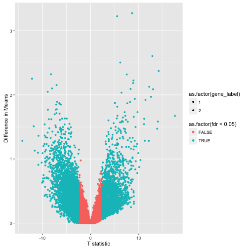
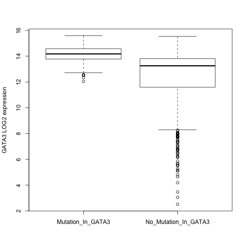

# Defining cohorts and performing differential expression analysis

Differential expression (DE) is a common analysis that determines if the mean
gene expression level differ between two groups. Most often we have two
groups, normal and disease. But, in the case of TCGA, normal tissue samples
are not always available. Nonetheless, samples can be grouped in many different
ways, and with the number of samples and the types of data, one can be quite creative with
analysis. In this work, I will be creating groups of samples based on somatic mutations,
changes in the DNA of tumors, and associating it with differentially expressed genes.

The first question: "what types of mutation data are available?"


```r
library(dplyr)
library(bigrquery)
library(scales)
library(ggplot2)
library(ISBCGCExamples)

q <- "SELECT
        Variant_Classification, COUNT(*) AS n
      FROM
        [isb-cgc:tcga_201510_alpha.Somatic_Mutation_calls]
      WHERE
        Study = 'BRCA'
      GROUP BY
        Variant_Classification"

result <- query_exec(q, project)
result
```

```
##      Variant_Classification     n
## 1  De_novo_Start_OutOfFrame    26
## 2         Missense_Mutation 75429
## 3           Frame_Shift_Del  4056
## 4           Start_Codon_Ins    13
## 5            Stop_Codon_Ins     4
## 6                    Silent 27612
## 7                     5'UTR  1392
## 8           Frame_Shift_Ins  3034
## 9              In_Frame_Ins   434
## 10           Stop_Codon_Del    16
## 11                      IGR  1641
## 12                   Intron  6617
## 13                  lincRNA   661
## 14        Nonsense_Mutation  6038
## 15             In_Frame_Del  1337
## 16    De_novo_Start_InFrame     7
## 17                      RNA  2644
## 18              Splice_Site  4158
## 19          Start_Codon_SNP    97
## 20                    3'UTR  2027
## 21         Nonstop_Mutation    94
## 22          Start_Codon_Del    25
```


This query is selecting all the variant classification labels for samples
in the BRCA study using the Somatic Mutation table. The GROUP BY portion of the query
ensures we only get each category once, similar to the DISTINCT keyword.

Oftentimes, people are interested in specific types of variants, such as exonic variants.
Here, I'm interested in whether *any* type of variant might be associated with
differential expression. In order to perform such an analysis, we
need to define two groups. For now, let's focus on the IL10 gene,
an anti-inflammatory cytokine (signalling molecule) used by the immune system. So
let's find out how many individuals have a mutation in IL10, in the BRCA study.


```r
q <- "SELECT
        ParticipantBarcode
      FROM
        [isb-cgc:tcga_201510_alpha.Somatic_Mutation_calls]
      WHERE
        Hugo_Symbol = 'IL10'
        AND Study = 'BRCA'
      GROUP BY
        ParticipantBarcode"

query_exec(q, project)
```

```
## [1] ParticipantBarcode
## <0 rows> (or 0-length row.names)
```

It turns out there's no data for that gene in the BRCA study. Maybe we should find out
What genes *do* have somatic mutations in BRCA, and how many samples? That
way we can make a more educated choice.


```r
q <- "SELECT
        COUNT (DISTINCT(pb)) AS sampleN,
        hugosymbols AS gene
      FROM (
        SELECT
            ParticipantBarcode AS pb,
            Hugo_Symbol AS hugosymbols
        FROM
            [isb-cgc:tcga_201510_alpha.Somatic_Mutation_calls]
        WHERE
            Study = 'BRCA'
        GROUP BY
            hugosymbols,
            pb)
      GROUP BY
        gene
      ORDER BY
        sampleN DESC"
genes <- query_exec(q, project)
head(genes)
```

```
##   sampleN    gene
## 1     627 Unknown
## 2     335  PIK3CA
## 3     334    TP53
## 4     206     TTN
## 5     123    CDH1
## 6     117   GATA3
```

In this query, first on the inside, we are selecting ParticipantBarcodes and gene
symbols, and grouping on those variables. This lets us get one count per gene
per sample. Then from that table generated on the interior of the query, we
count the number of gene symbols, giving us the number of samples with variants
in a particular gene.

OK, so we see that a fair number of variants are not associated with any gene,
and PIK3CA ranks first for the number of samples with mutations in that gene.
Let's check our results on one gene.


```r
q <- "SELECT count(hugosymbols)
        FROM (
          SELECT
            ParticipantBarcode, Hugo_Symbol as hugosymbols
          FROM
            [isb-cgc:tcga_201510_alpha.Somatic_Mutation_calls]
          WHERE
            Hugo_Symbol = 'GATA3'
            and Study = 'BRCA'
          GROUP BY
            ParticipantBarcode,
            hugosymbols )"
query_exec(q, project)
```

```
##   f0_
## 1 117
```

The inner select statement produces a table with a row for each participant.
Then we can count over that table to get the number of participants. This
number matches what we found above. You can see that if the aggregation variable
is not named, it gets a name like "f0_".

Now we need to define our groups, those with a variant in a particular gene,
and those without. Let's build a table of participant barcodes with a variant
in gene GATA3.

First let's get all ParticipantBarcode associated with BRCA.


```r
q <- "
  SELECT
    ParticipantBarcode,
  FROM
    [isb-cgc:tcga_201510_alpha.Somatic_Mutation_calls]
  WHERE
    Study = 'BRCA'
  GROUP BY
    ParticipantBarcode
 "
barcodesBRCA <- query_exec(q, project)
head(barcodesBRCA)
```

```
##   ParticipantBarcode
## 1       TCGA-A8-A07R
## 2       TCGA-BH-A1F8
## 3       TCGA-AO-A0J8
## 4       TCGA-AN-A0XN
## 5       TCGA-A8-A097
## 6       TCGA-C8-A27B
```

Then, let's get the barcodes for samples with a mutation in GATA3, since it
had a good number of samples according to the gene table we made above
(and I'm interested in immune related genes).


```r
q <- "
  SELECT
    ParticipantBarcode,
  FROM
    [isb-cgc:tcga_201510_alpha.Somatic_Mutation_calls]
  WHERE
    Hugo_Symbol = 'GATA3'
    AND Study = 'BRCA'
  GROUP BY
    ParticipantBarcode
 "
barcodesWithMutations <- query_exec(q, project)
head(barcodesWithMutations)
```

```
##   ParticipantBarcode
## 1       TCGA-OL-A5D8
## 2       TCGA-D8-A1J8
## 3       TCGA-A2-A0CV
## 4       TCGA-C8-A26V
## 5       TCGA-E2-A15J
## 6       TCGA-B6-A40C
```

Next, we get the participant barcodes that do not have mutations in GATA3,
using the following query.


```r
q <- "
SELECT
  ParticipantBarcode
FROM
  [isb-cgc:tcga_201510_alpha.Somatic_Mutation_calls]
WHERE ParticipantBarcode NOT IN (
    SELECT
      ParticipantBarcode,
    FROM
      [isb-cgc:tcga_201510_alpha.Somatic_Mutation_calls]
    WHERE
      Hugo_Symbol = 'GATA3'
      and Study = 'BRCA'
    GROUP BY
      ParticipantBarcode)
  and Study = 'BRCA'
GROUP BY ParticipantBarcode"
barcodesWithOUTMutations <- query_exec(q, project)
sum(barcodesWithMutations$ParticipantBarcode %in% barcodesWithOUTMutations$ParticipantBarcode)
```

```
## [1] 0
```

This gives us 117 samples with a variant in GATA3, 873 samples without a
variant in GATA3, which matches the number of samples that have mutation data in the MAF table (990).
Let's take a look at what kind of variants are found in GATA3, in case we
would like to eliminate some.


```r
q <- "
  SELECT
    vc,
    count(vc) as num_variants_in_class
  FROM (
    SELECT
      ParticipantBarcode,
      Variant_Classification as vc
    FROM
      [isb-cgc:tcga_201510_alpha.Somatic_Mutation_calls]
    WHERE
      Hugo_Symbol = 'GATA3'
      AND Study = 'BRCA'
    GROUP BY
      ParticipantBarcode,
      vc)
  GROUP BY vc
 "
query_exec(q, project)
```

```
##                  vc num_variants_in_class
## 1   Frame_Shift_Ins                    62
## 2 Nonsense_Mutation                     2
## 3       Splice_Site                    24
## 4 Missense_Mutation                    10
## 5    Stop_Codon_Ins                     1
## 6   Frame_Shift_Del                    19
## 7            Silent                     2
```

So we find that frame shift insertions are the most common type of variant,
followed by splice site variants.

Next, we compute the average gene expression over our defined
cohorts. To do this, we first select the participants with mutations
in GATA3, then in the "exterior" of the query, we select the normalized_count,
which is the gene expression level, for gene GATA3, only for tumor samples
(SampleTypeLetterCode = 'TP'), and only for participants with mutations in
GATA3, as already defined. With the normalized_count, we can use aggregation
functions to compute the mean and standard deviation on the LOG2 of expression.


```r
q <- "
SELECT
  AVG(LOG2(normalized_count+1)) as mean_expr,
  STDDEV(LOG2(normalized_count+1)) as sd_expr
FROM
  [isb-cgc:tcga_201510_alpha.mRNA_UNC_HiSeq_RSEM]
WHERE
  HGNC_gene_symbol = 'GATA3'
  AND SampleTypeLetterCode = 'TP'
  AND ParticipantBarcode IN (
  SELECT
    ParticipantBarcode
  FROM
    [isb-cgc:tcga_201510_alpha.Somatic_Mutation_calls]
  WHERE
    Hugo_Symbol = 'GATA3'
    and Study = 'BRCA'
  GROUP BY
    ParticipantBarcode )
"
query_exec(q, project)
```

```
##   mean_expr   sd_expr
## 1  14.11414 0.6700897
```


With the ability to compute means and stddevs, we can implement a  
T statistic using unpooled standard errors.

$$ \frac{(x - y)}{ \sqrt{ \frac{s_x^2}{n_x} + \frac{s_y^2}{n_y} } } $$

Where x and y are the means, $s_x^2$ is the squared standard error for mean x,
and $n_x$ is the number of samples related to x.


```r
q <- "
SELECT
  p.gene AS gene,
  p.study AS study,
  p.x AS x,
  p.sx2 AS sx2,
  p.nx AS nx,
  o.y AS y,
  o.sy2 AS sy2,
  o.ny AS ny,
  (p.x-o.y) / SQRT((p.sx2/p.nx) + (o.sy2/o.ny)) AS T
FROM (
  SELECT
    Study AS study,
    HGNC_gene_symbol AS gene,
    AVG(LOG2(normalized_count+1)) AS x,
    POW(STDDEV(LOG2(normalized_count+1)),2) AS sx2,
    COUNT(ParticipantBarcode) AS nx
  FROM
    [isb-cgc:tcga_201510_alpha.mRNA_UNC_HiSeq_RSEM]
  WHERE
    HGNC_gene_symbol = 'GATA3'
    AND SampleTypeLetterCode = 'TP'
    AND Study = 'BRCA'
    AND (ParticipantBarcode IN (
      SELECT
        m.ParticipantBarcode,
      FROM
        [isb-cgc:tcga_201510_alpha.Somatic_Mutation_calls] AS m
      WHERE
        m.Hugo_Symbol = 'GATA3'
        AND m.Study = 'BRCA'
      GROUP BY
        m.ParticipantBarcode )) /* end table of participant */
  GROUP BY
    gene,
    study ) AS p
JOIN (
  SELECT
    Study AS study,
    HGNC_gene_symbol AS gene,
    AVG(LOG2(normalized_count+1)) AS y,
    POW(STDDEV(LOG2(normalized_count+1)),2) AS sy2,
    COUNT(ParticipantBarcode) AS ny
  FROM
    [isb-cgc:tcga_201510_alpha.mRNA_UNC_HiSeq_RSEM]
  WHERE
    Study = 'BRCA'
    AND HGNC_gene_symbol = 'GATA3'
    AND SampleTypeLetterCode = 'TP'
    AND (ParticipantBarcode IN (
      SELECT
        ParticipantBarcode
      FROM
        [isb-cgc:tcga_201510_alpha.Somatic_Mutation_calls]
      WHERE
        Study = 'BRCA'
        AND (ParticipantBarcode NOT IN (
          SELECT
            m.ParticipantBarcode,
          FROM
            [isb-cgc:tcga_201510_alpha.Somatic_Mutation_calls] AS m
          WHERE
            m.Hugo_Symbol = 'GATA3'
            AND m.Study = 'BRCA'
          GROUP BY
            m.ParticipantBarcode )) /* end getting table of participants without mutations */
      GROUP BY
        ParticipantBarcode )) /* end getting table of participants */
  GROUP BY
    study,
    gene ) AS o
ON
  p.gene = o.gene
  AND p.study = o.study
GROUP BY
  gene,
  study,
  x,
  sx2,
  nx,
  y,
  sy2,
  ny,
  T
"
result1 <- query_exec(q, project)
result1
```

```
##    gene study        x       sx2  nx        y      sy2  ny        T
## 1 GATA3  BRCA 14.11414 0.4490203 116 12.44092 4.574784 872 17.52361
```

A little about this query: We are selecting the gene expression from our two
previously defined groups, which results in two tables that need to be joined.
The two tables are named o and p (not great names, I know), which lets us
perform aggregation functions on each table separately to get the mean gene
expression in each group. Then, it's just a matter of computing the T statistic
using the above formula.

In building this query, I found that one cannot give the source tables an alias.
It seems to throw off the 'ParticipantBarcode IN ' statement, and give weird
errors. Second, make sure the two tables we're joining have different aliases!

Finally, let's just "bang-the-hammer" and query ALL genes!


```r
q <- "
SELECT
  p.gene as gene,
  p.study as study,
  ABS(p.x - o.y) as mean_diff,
  p.x  as x,
  p.sx2 as sx2,
  p.nx as nx,
  o.y as y,
  o.sy2 as sy2,
  o.ny as ny,
  (p.x-o.y) / SQRT((p.sx2/p.nx) + (o.sy2/o.ny)) as T
FROM (
  SELECT
    Study as study,
    HGNC_gene_symbol as gene,
    AVG(LOG2(normalized_count+1)) as x,
    POW(STDDEV(LOG2(normalized_count+1)),2) as sx2,
    COUNT(ParticipantBarcode) as nx
  FROM
    [isb-cgc:tcga_201510_alpha.mRNA_UNC_HiSeq_RSEM]
  WHERE
    SampleTypeLetterCode = 'TP'
    AND Study = 'BRCA'
    and (ParticipantBarcode IN (
      SELECT
        m.ParticipantBarcode,
      FROM
        [isb-cgc:tcga_201510_alpha.Somatic_Mutation_calls] as m
      WHERE
        m.Hugo_Symbol = 'GATA3'
        AND m.Study = 'BRCA'
      GROUP BY
        m.ParticipantBarcode
      )) /* end table of participant */
    GROUP BY gene, study
    ) as p
JOIN (
   SELECT
   Study as study,
   HGNC_gene_symbol as gene,
   AVG(LOG2(normalized_count+1)) AS y,
   POW(STDDEV(LOG2(normalized_count+1)),2) AS sy2,
   COUNT(ParticipantBarcode) as ny
  FROM
   [isb-cgc:tcga_201510_alpha.mRNA_UNC_HiSeq_RSEM]
  WHERE
   SampleTypeLetterCode = 'TP'
   and Study = 'BRCA'
   AND (ParticipantBarcode IN (
     SELECT
       ParticipantBarcode
     FROM
       [isb-cgc:tcga_201510_alpha.Somatic_Mutation_calls]
     WHERE Study = 'BRCA'
     and (ParticipantBarcode NOT IN (
         SELECT
           m.ParticipantBarcode,
         FROM
           [isb-cgc:tcga_201510_alpha.Somatic_Mutation_calls] as m
         WHERE
           m.Hugo_Symbol = 'GATA3'
           and m.Study = 'BRCA'
         GROUP BY
           m.ParticipantBarcode
         )) /* end getting table of participants without mutations */
     GROUP BY ParticipantBarcode
   )) /* end getting table of participants */
  GROUP BY
   study, gene
 ) AS o
ON
  p.gene = o.gene and p.study = o.study
GROUP BY gene, study, x, sx2, nx, y, sy2, ny, T, mean_diff
ORDER BY mean_diff DESC
"
system.time(result1 <- query_exec(q, project))
```

```
## 
Retrieving data:  2.9s
Retrieving data:  5.2s
```

```
##    user  system elapsed 
##   1.280   0.114   9.194
```

```r
compute_df <- function(d) {
  ((d$sx2/d$nx + d$sy2/d$ny)^2) /
  ((1/(d$nx-1))*(d$sx2/d$nx)^2 + (1/(d$ny-1))*(d$sy2/d$ny)^2)
}

result1$df <- compute_df(result1)
result1$p_value <- sapply(1:nrow(result1), function(i) 2*pt(abs(result1$T[i]), result1$df[i],lower=FALSE))
result1$fdr <- p.adjust(result1$p_value, "fdr")
result1$gene_label <- 1
result1$gene_label[result1$gene == "GATA3"] <- 2

# ordered by difference in means
head(result1)
```

```
##     gene study mean_diff         x       sx2  nx        y       sy2  ny
## 1  KCNJ3  BRCA  3.273704  7.485121 14.685614 116 4.211417 15.456478 872
## 2   CPB1  BRCA  3.226143  9.392237 36.573811 116 6.166094 24.273983 872
## 3   AGR3  BRCA  2.605398 11.179273  2.443981 116 8.573875 17.623450 872
## 4    TRH  BRCA  2.504631  5.231328 18.403546 116 2.726697  6.268322 872
## 5  FSIP1  BRCA  2.373198  8.866036  2.245905 116 6.492839  7.712446 872
## 6 CRABP1  BRCA  2.321596  3.410742  7.469231 116 5.732338 13.186676 872
##           T       df      p_value          fdr gene_label
## 1  8.617236 149.0709 9.190821e-15 1.507825e-12          1
## 2  5.507509 136.0631 1.756605e-07 3.090353e-06          1
## 3 12.823558 393.6262 1.069316e-31 3.549239e-28          1
## 4  6.150346 125.6233 9.514207e-09 2.470345e-07          1
## 5 14.130735 237.5220 2.587392e-33 1.288198e-29          1
## 6 -8.233218 174.0920 4.162527e-14 6.050855e-12          1
```

```r
# ordered by T statistic
head(result1[order(result1$T, decreasing=T), ])
```

```
##       gene study mean_diff         x       sx2  nx         y       sy2  ny
## 39   GATA3  BRCA  1.673222 14.114141 0.4490203 116 12.440919  4.574784 872
## 5    FSIP1  BRCA  2.373198  8.866036 2.2459046 116  6.492839  7.712446 872
## 54  TBC1D9  BRCA  1.583615 13.761795 1.0174506 116 12.178180  3.555983 872
## 77   FOXA1  BRCA  1.471983 12.926657 0.2378543 116 11.454674  8.094412 872
## 15 DNAJC12  BRCA  2.087723 10.356336 2.2985499 116  8.268613  5.297170 872
## 3     AGR3  BRCA  2.605398 11.179273 2.4439810 116  8.573875 17.623450 872
##           T       df      p_value          fdr gene_label
## 39 17.52361 513.4457 3.095801e-54 6.165288e-50          2
## 5  14.13074 237.5220 2.587392e-33 1.288198e-29          1
## 54 13.97055 239.9444 7.424160e-33 2.957043e-29          1
## 77 13.82704 947.9646 9.549048e-40 6.338976e-36          1
## 15 12.97503 193.9135 4.033130e-28 8.924421e-25          1
## 3  12.82356 393.6262 1.069316e-31 3.549239e-28          1
```

```r
# ordered by FDR
head(result1[order(result1$fdr, decreasing=F), ])
```

```
##       gene study mean_diff          x       sx2  nx         y       sy2
## 39   GATA3  BRCA  1.673222 14.1141410 0.4490203 116 12.440919  4.574784
## 77   FOXA1  BRCA  1.471983 12.9266565 0.2378543 116 11.454674  8.094412
## 138  OPRK1  BRCA  1.283247  0.3843466 0.3377241 116  1.667593  4.605231
## 5    FSIP1  BRCA  2.373198  8.8660364 2.2459046 116  6.492839  7.712446
## 54  TBC1D9  BRCA  1.583615 13.7617954 1.0174506 116 12.178180  3.555983
## 3     AGR3  BRCA  2.605398 11.1792730 2.4439810 116  8.573875 17.623450
##      ny         T       df      p_value          fdr gene_label
## 39  872  17.52361 513.4457 3.095801e-54 6.165288e-50          2
## 77  872  13.82704 947.9646 9.549048e-40 6.338976e-36          1
## 138 872 -14.17745 634.8217 7.749128e-40 6.338976e-36          1
## 5   872  14.13074 237.5220 2.587392e-33 1.288198e-29          1
## 54  872  13.97055 239.9444 7.424160e-33 2.957043e-29          1
## 3   872  12.82356 393.6262 1.069316e-31 3.549239e-28          1
```

```r
qplot(data=result1, x=T, y=mean_diff, shape=as.factor(gene_label), col=as.factor(fdr < 0.05), ylab="Difference in Means", xlab="T statistic")
```

```
## Warning: Removed 267 rows containing missing values (geom_point).
```



Wow! So did we do that right? Let's check on a single gene. We'll pull down
the actual expression values, and use the R T-test.


```r
q <- "
SELECT HGNC_gene_symbol, ParticipantBarcode, LOG2(normalized_count+1)
FROM [isb-cgc:tcga_201510_alpha.mRNA_UNC_HiSeq_RSEM]
WHERE Study = 'BRCA'
and HGNC_gene_symbol = 'GATA3'
and SampleTypeLetterCode = 'TP'
and (ParticipantBarcode IN (
  SELECT
    m.ParticipantBarcode,
  FROM
    [isb-cgc:tcga_201510_alpha.Somatic_Mutation_calls] as m
  WHERE
    m.Hugo_Symbol = 'GATA3'
    AND m.Study = 'BRCA'
  GROUP BY
    m.ParticipantBarcode
  ))
"
mutExpr <- query_exec(q, project)   # SOME DUPLCIATES

q <- "
SELECT HGNC_gene_symbol, ParticipantBarcode, LOG2(normalized_count+1)
FROM [isb-cgc:tcga_201510_alpha.mRNA_UNC_HiSeq_RSEM]
WHERE Study = 'BRCA'
and HGNC_gene_symbol = 'GATA3'
and SampleTypeLetterCode = 'TP'
and (ParticipantBarcode IN (
  SELECT
    ParticipantBarcode
  FROM
    [isb-cgc:tcga_201510_alpha.Somatic_Mutation_calls]
  WHERE Study = 'BRCA'
  and (ParticipantBarcode NOT IN (
      SELECT
        m.ParticipantBarcode,
      FROM
        [isb-cgc:tcga_201510_alpha.Somatic_Mutation_calls] as m
      WHERE
        m.Hugo_Symbol = 'GATA3'
        and m.Study = 'BRCA'
      GROUP BY
        m.ParticipantBarcode
      )) /* end getting table of participants without mutations */
  GROUP BY ParticipantBarcode
)) /* end getting table of participants */
"
wtExpr <- query_exec(q, project)   # SOME DUPLCIATES

t.test(mutExpr$f0_, wtExpr$f0_)
```

```
## 
## 	Welch Two Sample t-test
## 
## data:  mutExpr$f0_ and wtExpr$f0_
## t = 17.524, df = 513.45, p-value < 2.2e-16
## alternative hypothesis: true difference in means is not equal to 0
## 95 percent confidence interval:
##  1.485635 1.860810
## sample estimates:
## mean of x mean of y 
##  14.11414  12.44092
```

```r
boxplot(list(Mutation_In_GATA3=mutExpr$f0_, No_Mutation_In_GATA3=wtExpr$f0_), ylab="GATA3 LOG2 expression")
```



So, we have found the same gene expression means and standard deviation, degrees of freedom,
and T statistic. Looks good! GATA3 has the most signficant result, interesting (or not?)
since we split our samples on mutations in GATA3!

This result has been previously seen in: http://www.ncbi.nlm.nih.gov/pmc/articles/PMC4303202/


```r
sessionInfo()
```

```
## R version 3.2.4 (2016-03-10)
## Platform: x86_64-apple-darwin13.4.0 (64-bit)
## Running under: OS X 10.11.4 (El Capitan)
## 
## locale:
## [1] en_US.UTF-8/en_US.UTF-8/en_US.UTF-8/C/en_US.UTF-8/en_US.UTF-8
## 
## attached base packages:
## [1] stats     graphics  grDevices utils     datasets  methods   base     
## 
## other attached packages:
## [1] ISBCGCExamples_0.1.1 ggplot2_2.1.0        scales_0.4.0        
## [4] bigrquery_0.2.0      dplyr_0.4.3         
## 
## loaded via a namespace (and not attached):
##  [1] Rcpp_0.12.4      knitr_1.12.3     magrittr_1.5     munsell_0.4.3   
##  [5] colorspace_1.2-6 R6_2.1.2         stringr_1.0.0    httr_1.1.0      
##  [9] plyr_1.8.3       tools_3.2.4      parallel_3.2.4   grid_3.2.4      
## [13] gtable_0.2.0     DBI_0.3.1        digest_0.6.9     openssl_0.9.2   
## [17] assertthat_0.1   formatR_1.3      curl_0.9.6       evaluate_0.8.3  
## [21] mime_0.4         labeling_0.3     stringi_1.0-1    jsonlite_0.9.19 
## [25] markdown_0.7.7
```
