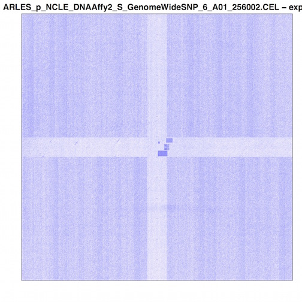

# Accessing low level data with R/Bioconductor

When working in docker containers, there are two ways to do it: locally and
in the cloud. It's probably a good idea to start out locally, to get things
working on a small example before moving to the cloud, where you can start
accruing charges.

First I'm going to start a bioconductor container locally and work on some
Affy SNP 6.0 data, and then I'll briefly go over doing the same thing in the
cloud.

# Working with a local docker container

Let us suppose you would rather work with your local machine. Well, we can
still use docker and google cloud services to get some research done!

So, first, make sure you've got VirtualBox VM and docker installed, and both running.
If you're on a mac, that means starting the daemon (with the Docker Quickstart Terminal app).
That's going to take care of getting the VM running and configuring the terminal
environment.

NOTE: Make sure your VM has adequate memory and disk space!

```
# if you're on a mac, start the docker quickstart terminal and skip the following commands
# else try:
docker-machine start default
docker-machine env default
```

With that done, you should see something like:

```
Starting machine default...
(default) OUT | Starting VM...
...
                        ##         .
                  ## ## ##        ==
               ## ## ## ## ##    ===
           /"""""""""""""""""\___/ ===
      ~~~ {~~ ~~~~ ~~~ ~~~~ ~~~ ~ /  ===- ~~~
           \______ o           __/
             \    \         __/
              \____\_______/


docker is configured to use the default machine with IP xxx.yyy.zz.www
For help getting started, check out the docs at https://docs.docker.com
```

Then you can get the status:

```
docker-machine status default
```

And we can SSH into the docker machine:

```
docker-machine ssh default
exit
```

Now, since the terminal env points to the VM, we can pull down the
Bioconductor docker image

```
docker pull bioconductor/release_microarray
```

That's going to download a pretty large amount of stuff (in the 3.x GBs), so
now might be time to refill your coffee.

When the download and extraction finishes, we can start up the docker container

```
docker run -ti --privileged bioconductor/release_microarray /bin/bash
```

The -i starts interactive dockers and -t starts a pseudo TTY so we can
interact with R/Bioconductor! You are now within a docker container.
Relish the moment. OK, stop relishing.

The first thing I'm going to do is install gcloud, which is really quick

```
curl https://sdk.cloud.google.com | bash
# and start a new terminal session
bash
```

Then we can get authenticated by opening a browser and pasting the long
address, bringing back the auth string, and entering the project ID.

```
gcloud init
```

We can take a look what buckets are available to us:

```
gsutil ls
```


OK, now, we need to be able to access data that sitting in a open access
bucket called "gs://isb-cgc-open". To do that we're going to use gcsfuse to mount the
google bucket on our file system. Then we can interact with it just like any other
directory.

https://github.com/GoogleCloudPlatform/gcsfuse

We need to use daemon to run gcsfuse in the background, so we can continue to
work interactively.

```
apt-get install fuse curl daemon
curl -L -O https://github.com/GoogleCloudPlatform/gcsfuse/releases/download/v0.12.0/gcsfuse_0.12.0_amd64.deb
sudo dpkg --install gcsfuse_0.12.0_amd64.deb
```

*** At this point we might want to save the state of our docker image so we
don't have to keep installing these package each time we use it. ***

First we'll try to mount some open access SNP arrays

```
mkdir /media/dat
daemon -- gcsfuse isb-cgc-open  /media/dat
ls /media/dat/ccle/SNP_Arrays | head
```


Hey! It works!

```
ARLES_p_NCLE_DNAAffy2_S_GenomeWideSNP_6_A01_256002.CEL
ARLES_p_NCLE_DNAAffy2_S_GenomeWideSNP_6_A02_256004.CEL
ARLES_p_NCLE_DNAAffy2_S_GenomeWideSNP_6_A03_256006.CEL
```

OK! Let's fire up R, and see if we can read a file!

```
R
```

To work with the Affy SNP 6.0 CEL files, we're going to use the Bioconductor
package "oligo". To properly read the files, we're going to have to download
a large annotation package.

```
source("https://bioconductor.org/biocLite.R")
biocLite("pd.genomewidesnp.6")
library(oligo)
library(pd.genomewidesnp.6)

celfiles <- list.files("/media/dat/ccle/SNP_Arrays/", pattern=".CEL")
celpaths <- sapply(celfiles[1:3], function(a) paste("/media/dat/ccle/SNP_Arrays/", a, sep=""))

rawData <- read.celfiles(celpaths)

pdf("image_cel1.pdf")
image(rawData, which=1, transfo=log2)
dev.off()
```

Success!!  Now we need to get that image out of the docker. After we exit from
R, we can see the file. Without logging out of the docker container, I'm going
to open another terminal window, and copy out that file.

```
eval "$(docker-machine env default)"
docker ps # get the container ID
docker cp 1cf74ce69172:image_cel1.pdf .
```



So, we mounted a bucket in a docker container. Read a raw CEL file from that
bucket, and using a bioconductor package, produced an image of that microarray.
And finally copied it out to our local system.

# Working In the Cloud

Another, even more flexible way of doing this work, is to start up a compute instance
running the bioconductor docker image, and then access some raw data in a Google bucket.

Fortunately, starting up a cloud instance with everything you need
is pretty easy. Start out by pointing your browser to:

http://googlegenomics.readthedocs.org/en/latest/use_cases/run_familiar_tools/bioconductor.html

On that page, there's a link to information about the docker containers
maintained by Bioconductor, and another link called "click-to-deploy Bioconductor".
That's the one we want. Click away!

That's going bring you to the Google Developer Console where you can select the
correct cloud project. If you don't have a project yet, make sure to sign up,
and get that free compute time!

I'm going to select a 20GB disk and the "bioconductor/release_microarray" image. After you
click-to-deploy, you get a screen telling us that it's going to take 5-15
minutes to boot. It's a good time to make some coffee. Or if you haven't
installed Google gcloud yet, you can do that (https://cloud.google.com/sdk/).

Once the instance has loaded, we can SSH into it using gcloud compute ssh

https://cloud.google.com/sdk/gcloud/reference/compute/ssh

or the web console interface (from the google developers console,
  click on compute engine and find the appropriate VM SSH link).

And, we can interface with the docker through RStudioServer. To log into RStudioServer, first use the following gcloud command on your local workstation to create an ssh tunnel between your local workstation and the Compute Engine instance:

```
gcloud compute ssh --ssh-flag="-L8787:localhost:8787" --ssh-flag="-f" --ssh-flag="-N" --project=YOUR_PROJECT_ID --zone us-central1-f Your-vm-name
```

Then navigate to http://localhost:8787 and login with username:rstudio and password:rstudio.

If you would like to open a bash shell in the docker image, first use the SSH button above to connect to the instance. Then from the Compute Engine instance, run the following command to invoke bash from within the Docker image:

```
sudo docker run -ti --user rstudio --workdir /home/rstudio --volume /mnt/data:/home/rstudio/data bioconductor/release_microarray:latest bash
```
