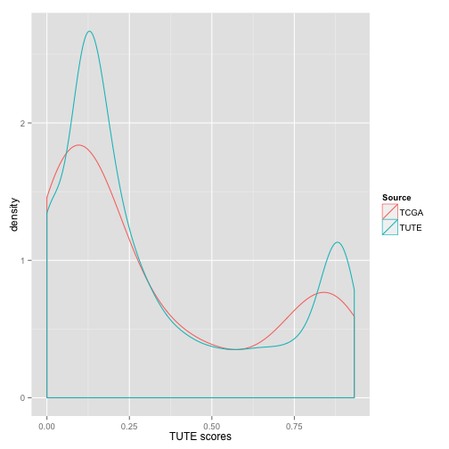
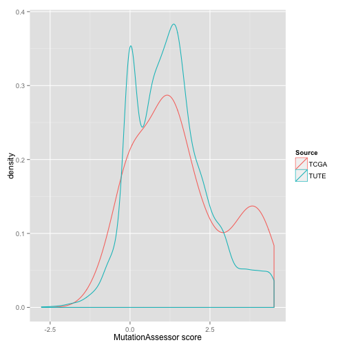

# Somatic Mutations

The goal of this notebook is to introduce you to the Somatic Mutations BigQuery table.
This table is based on the open-access somatic mutation calls available in MAF files at the DCC. In addition to uploading all current MAF files from the DCC, the mutations were also annotated using Oncotator. A subset of the columns in the underlying MAF files and a subset of the Oncotator outputs were then assembled in this table.
In addition, the ETL process includes several data-cleaning steps because many tumor types actually have multiple current MAF files and therefore potentially duplicate mutation calls. In some cases, a tumor sample may have had mutations called relative to both a blood-normal and an adjacent-tissue sample, and in other cases MAF files may contain mutations called on more than one aliquot from the same sample. Every effort was made to include all of the available data at the DCC while avoiding having multiple rows in the mutation table describing the same somatic mutation. Note, however, that if the same mutation was called by multiple centers and appeared in different MAF files, it may be described on muliple rows (as you will see later in this notebook). Furthermore, in some cases, the underlying MAF file may have been based on a multi-center mutationa-calling exercise, in which case you may see a list of centers in the Center field, eg "bcgsc.ca;broad.mit.edu;hgsc.bcm.edu;mdanderson.org;ucsc.edu".
In conclusion, if you are counting up the number of mutations observed in a sample or a patient or a tumor-type, be sure to include the necessary GROUP BY clause(s) in order to avoid double-counting!

As usual, in order to work with BigQuery, you need to import the bigquery module (gcp.bigquery) and you need to know the name(s) of the table(s) you are going to be working with:


```r
require(bigrquery) || install.packages("bigrquery")
```

```
## [1] TRUE
```

```r
require(ggplot2) || install.packages("ggplot2")
```

```
## [1] TRUE
```

```r
library(ISBCGCExamples)

mutTable <- "[isb-cgc:tcga_201510_alpha.Somatic_Mutation_calls]"
```

Let's start by taking a look at the table schema:


```r
querySql <- paste("SELECT * FROM ",mutTable," limit 1", sep="")
result <- query_exec(querySql, project=project)
```

```
## Auto-refreshing stale OAuth token.
```

```r
data.frame(Columns=colnames(result))
```

```
##                                 Columns
## 1                    ParticipantBarcode
## 2                   Tumor_SampleBarcode
## 3                  Tumor_AliquotBarcode
## 4            Tumor_SampleTypeLetterCode
## 5                  Normal_SampleBarcode
## 6                 Normal_AliquotBarcode
## 7           Normal_SampleTypeLetterCode
## 8                                 Study
## 9                 Annotation_Transcript
## 10 CCLE_ONCOMAP_Total_Mutations_In_Gene
## 11     COSMIC_Total_Alterations_In_Gene
## 12                               Center
## 13                           Chromosome
## 14                  DNARepairGenes_Role
## 15                             DbSNP_RS
## 16                     DbSNP_Val_Status
## 17                             DrugBank
## 18                         End_Position
## 19                       Entrez_Gene_Id
## 20                           GC_Content
## 21              GENCODE_Transcript_Name
## 22            GENCODE_Transcript_Status
## 23              GENCODE_Transcript_Type
## 24                GO_Biological_Process
## 25                GO_Cellular_Component
## 26                GO_Molecular_Function
## 27                            Gene_Type
## 28                        Genome_Change
## 29               HGNC_Accession_Numbers
## 30                        HGNC_CCDS_IDs
## 31  HGNC_Ensembl_ID_Supplied_By_Ensembl
## 32                         HGNC_HGNC_ID
## 33                     HGNC_Locus_Group
## 34                      HGNC_Locus_Type
## 35        HGNC_OMIM_ID_Supplied_By_NCBI
## 36         HGNC_RefSeq_Supplied_By_NCBI
## 37        HGNC_UCSC_ID_Supplied_By_UCSC
## 38  HGNC_UniProt_ID_Supplied_By_UniProt
## 39                          Hugo_Symbol
## 40                      Mutation_Status
## 41                           NCBI_Build
## 42                   Normal_Seq_Allele1
## 43                   Normal_Seq_Allele2
## 44            Normal_Validation_Allele1
## 45            Normal_Validation_Allele2
## 46                          OREGANNO_ID
## 47                       Protein_Change
## 48                          Ref_Context
## 49                     Reference_Allele
## 50                       Refseq_Prot_Id
## 51     Secondary_Variant_Classification
## 52                      Sequence_Source
## 53                            Sequencer
## 54                       Start_Position
## 55                     SwissProt_Acc_Id
## 56                   SwissProt_Entry_Id
## 57                      Transcript_Exon
## 58                  Transcript_Position
## 59                    Transcript_Strand
## 60                    Tumor_Seq_Allele1
## 61                    Tumor_Seq_Allele2
## 62             Tumor_Validation_Allele1
## 63             Tumor_Validation_Allele2
## 64                        UniProt_AApos
## 65                       UniProt_Region
## 66                    Validation_Method
## 67               Variant_Classification
## 68                         Variant_Type
## 69                          cDNA_Change
```

That's a lot of fields! Let's dig in a bit further to see what is included in this table. For example let's count up the number of unique patients, tumor-samples, and normal-samples based on barcode identifiers:


```r
for (x in c("ParticipantBarcode", "Tumor_SampleBarcode", "Normal_SampleBarcode")) {
  querySql <- paste("SELECT COUNT(DISTINCT(",x,"), 25000) AS n ",
                    "FROM ",mutTable)
  result <- query_exec(querySql, project=project)
  cat(x, ": ", result[[1]], "\n")
}
```

```
## ParticipantBarcode :  8373 
## Tumor_SampleBarcode :  8435 
## Normal_SampleBarcode :  8754
```

Now let's look at a few key fields and find the top-5 most frequent values in each field:


```r
buildQuery <- function(x) {
  paste("
  SELECT ",x,", COUNT(*) AS n
  FROM [isb-cgc:tcga_201510_alpha.Somatic_Mutation_calls]
  WHERE ( ",x," IS NOT NULL )
  GROUP BY ",x,"
  ORDER BY n DESC
  LIMIT 5", sep="")
}

query_exec(buildQuery("Hugo_Symbol"), project=project)
```

```
##   Hugo_Symbol     n
## 1     Unknown 66354
## 2         TTN 24171
## 3       MUC16 15058
## 4         FLG 13068
## 5       OBSCN  7986
```

```r
query_exec(buildQuery("Center"), project=project)
```

```
##             Center       n
## 1    broad.mit.edu 3998891
## 2         bcgsc.ca  646933
## 3     hgsc.bcm.edu  485994
## 4 genome.wustl.edu  374934
## 5         ucsc.edu  190786
```

```r
query_exec(buildQuery("Mutation_Status"), project=project)
```

```
##   Mutation_Status       n
## 1         Somatic 5813176
```

```r
query_exec(buildQuery("Protein_Change"), project=project)
```

```
##   Protein_Change    n
## 1          p.M1I 2352
## 2        p.V600E 1243
## 3        p.R132H 1042
## 4        p.E545K  624
## 5          p.M1V  553
```

Everyone probably recognizes the V600E mutation in the previous result, so let's use that well-known BRAF mutation as a way to explore what other information is available in this table.


```r
querySql <- "
SELECT
  Tumor_SampleBarcode,
  Study,
  Hugo_Symbol,
  Genome_Change,
  Protein_Change
FROM
  [isb-cgc:tcga_201510_alpha.Somatic_Mutation_calls]
WHERE
  ( Hugo_Symbol='BRAF'
    AND Protein_Change='p.V600E' )
GROUP BY
  Tumor_SampleBarcode,
  Study,
  Hugo_Symbol,
  Genome_Change,
  Protein_Change
ORDER BY
  Study,
  Tumor_SampleBarcode"

result <- query_exec(querySql, project=project)
head(result)
```

```
##   Tumor_SampleBarcode Study Hugo_Symbol       Genome_Change Protein_Change
## 1    TCGA-YF-AA3L-01A  BLCA        BRAF g.chr7:140453136A>T        p.V600E
## 2    TCGA-ZU-A8S4-01A  CHOL        BRAF g.chr7:140453136A>T        p.V600E
## 3    TCGA-A6-5661-01A  COAD        BRAF g.chr7:140453136A>T        p.V600E
## 4    TCGA-A6-5665-01A  COAD        BRAF g.chr7:140453136A>T        p.V600E
## 5    TCGA-A6-6649-01A  COAD        BRAF g.chr7:140453136A>T        p.V600E
## 6    TCGA-A6-6653-01A  COAD        BRAF g.chr7:140453136A>T        p.V600E
```

Let's count these mutations up by study (tumor-type):


```r
querySql <- "
SELECT
  Study, COUNT(*) AS n
FROM
  [isb-cgc:tcga_201510_alpha.Somatic_Mutation_calls]
WHERE
  ( Hugo_Symbol='BRAF'
    AND Protein_Change='p.V600E' )
GROUP BY
  Study
HAVING n > 1
ORDER BY n DESC
"

query_exec(querySql, project=project)
```

```
##    Study   n
## 1   THCA 724
## 2   SKCM 441
## 3   LUAD  27
## 4   COAD  25
## 5   KIRP   6
## 6   CHOL   4
## 7    LGG   4
## 8    GBM   4
## 9   HNSC   2
## 10  BLCA   2
```

You may have noticed that in our earlier query, we did a GROUP BY to make sure that we didn't count the same mutation called on the same sample more than once. We might want to GROUP BY patient instead to see if that changes our counts -- we may have multiple samples from some patients.


```r
querySql <- "
SELECT
  ParticipantBarcode,
  Study,
  Hugo_Symbol,
  Genome_Change,
  Protein_Change
FROM
  [isb-cgc:tcga_201510_alpha.Somatic_Mutation_calls]
WHERE
  ( Hugo_Symbol='BRAF'
    AND Protein_Change='p.V600E' )
GROUP BY
  ParticipantBarcode,
  Study,
  Hugo_Symbol,
  Genome_Change,
  Protein_Change
ORDER BY
  Study,
  ParticipantBarcode"

result <- query_exec(querySql, project=project)
head(result)
```

```
##   ParticipantBarcode Study Hugo_Symbol       Genome_Change Protein_Change
## 1       TCGA-YF-AA3L  BLCA        BRAF g.chr7:140453136A>T        p.V600E
## 2       TCGA-ZU-A8S4  CHOL        BRAF g.chr7:140453136A>T        p.V600E
## 3       TCGA-A6-5661  COAD        BRAF g.chr7:140453136A>T        p.V600E
## 4       TCGA-A6-5665  COAD        BRAF g.chr7:140453136A>T        p.V600E
## 5       TCGA-A6-6649  COAD        BRAF g.chr7:140453136A>T        p.V600E
## 6       TCGA-A6-6653  COAD        BRAF g.chr7:140453136A>T        p.V600E
```

```r
table(result$Study)
```

```
## 
## BLCA CHOL COAD  GBM HNSC KIRP  LGG LUAD READ SKCM THCA 
##    1    1   25    4    1    1    2    8    1  170  258
```

When we counted the number of mutated samples, we found 261 THCA samples, but when we counted the number of patients, we found 258 THCA patients, so let's see what's going on there.


```r
querySql <- "
SELECT
  ParticipantBarcode,
  COUNT(*) AS m
FROM (
  SELECT
    ParticipantBarcode,
    Tumor_SampleBarcode,
    COUNT(*) AS n
  FROM
    [isb-cgc:tcga_201510_alpha.Somatic_Mutation_calls]
  WHERE
    ( Hugo_Symbol='BRAF'
      AND Protein_Change='p.V600E'
      AND Study='THCA' )
  GROUP BY
    ParticipantBarcode,
    Tumor_SampleBarcode,
    )
GROUP BY
  ParticipantBarcode
HAVING
  m > 1
ORDER BY
  m DESC"

result <- query_exec(querySql, project=project)
head(result)
```

```
##   ParticipantBarcode m
## 1       TCGA-J8-A3YH 2
## 2       TCGA-EM-A2CS 2
## 3       TCGA-EM-A2P1 2
```

Sure enough, we see that the same mutation is reported twice for each of these three patients. Let's look at why:


```r
querySql <- "
SELECT
  ParticipantBarcode,
  Tumor_SampleBarcode,
  Tumor_SampleTypeLetterCode,
  Normal_SampleBarcode,
  Normal_SampleTypeLetterCode,
  Center,
FROM
  [isb-cgc:tcga_201510_alpha.Somatic_Mutation_calls]
WHERE
  ( Hugo_Symbol='BRAF'
    AND Protein_Change='p.V600E'
    AND Study='THCA'
    AND ParticipantBarcode='TCGA-EM-A2P1' )
ORDER BY
  Tumor_SampleBarcode,
  Normal_SampleBarcode,
  Center"

result <- query_exec(querySql, project=project)
head(result)
```

```
##   ParticipantBarcode Tumor_SampleBarcode Tumor_SampleTypeLetterCode
## 1       TCGA-EM-A2P1    TCGA-EM-A2P1-01A                         TP
## 2       TCGA-EM-A2P1    TCGA-EM-A2P1-01A                         TP
## 3       TCGA-EM-A2P1    TCGA-EM-A2P1-01A                         TP
## 4       TCGA-EM-A2P1    TCGA-EM-A2P1-06A                         TM
## 5       TCGA-EM-A2P1    TCGA-EM-A2P1-06A                         TM
## 6       TCGA-EM-A2P1    TCGA-EM-A2P1-06A                         TM
##   Normal_SampleBarcode Normal_SampleTypeLetterCode        Center
## 1     TCGA-EM-A2P1-10A                          NB      bcgsc.ca
## 2     TCGA-EM-A2P1-10A                          NB broad.mit.edu
## 3     TCGA-EM-A2P1-10A                          NB  hgsc.bcm.edu
## 4     TCGA-EM-A2P1-10A                          NB      bcgsc.ca
## 5     TCGA-EM-A2P1-10A                          NB broad.mit.edu
## 6     TCGA-EM-A2P1-10A                          NB  hgsc.bcm.edu
```

Aha! not only did this patient provide both a primary tumor (TP) and a metastatic (TM) sample, but we have mutation calls from three different centers.

Finally, let's pick out one of these mutations and see what some of the other fields in this table can tell us:


```r
querySql <- "
SELECT
  ParticipantBarcode,
  Tumor_SampleTypeLetterCode,
  Normal_SampleTypeLetterCode,
  Study,
  Center,
  Variant_Type,
  Variant_Classification,
  Genome_Change,
  cDNA_Change,
  Protein_Change,
  UniProt_Region,
  COSMIC_Total_Alterations_In_Gene,
  DrugBank
FROM
  [isb-cgc:tcga_201510_alpha.Somatic_Mutation_calls]
WHERE
  ( Hugo_Symbol='BRAF'
    AND Protein_Change='p.V600E'
    AND Study='THCA'
    AND ParticipantBarcode='TCGA-EM-A2P1'
    AND Tumor_SampleTypeLetterCode='TP'
    AND Center='broad.mit.edu' )"

result <- query_exec(querySql, project=project)
head(result)
```

```
##   ParticipantBarcode Tumor_SampleTypeLetterCode
## 1       TCGA-EM-A2P1                         TP
##   Normal_SampleTypeLetterCode Study        Center Variant_Type
## 1                          NB  THCA broad.mit.edu          SNP
##   Variant_Classification       Genome_Change cDNA_Change Protein_Change
## 1      Missense_Mutation g.chr7:140453136A>T   c.1799T>A        p.V600E
##                                             UniProt_Region
## 1 Protein kinase. {ECO:0000255|PROSITE- ProRule:PRU00159}.
##   COSMIC_Total_Alterations_In_Gene
## 1                            27380
##                                                                           DrugBank
## 1 Dabrafenib(DB08912)|Regorafenib(DB08896)|Sorafenib(DB00398)|Vemurafenib(DB08881)
```

When working with variants or mutations, there is another public BigQuery table that you might find useful. Developed by Tute Genomics, this comprehensive, publicly-available database of over 8.5 billion known variants was announced earlier this year. This table includes several types of annotations and scores, such ase Polyphen2 and MutationAssessor, and a proprietary "Tute score" which estimates whether a SNP or indel is likely to be associate with Mendelian phenotypes.

For example, you can look up all exonic BRAF mutations in the TuteTable in less than 20 seconds:


```r
querySql <- "
SELECT
  Chr,
  Start,
  Func,
  Gene,
  AA,
  Polyphen2_HDIV_score,
  Polyphen2_HVAR_score,
  MutationAssessor_score,
  TUTE
FROM
  [silver-wall-555:TuteTable.hg19]
WHERE
  ( Gene='BRAF'
    AND Func='exonic' )
ORDER BY
  Start ASC"

tuteBRAFscores <- query_exec(querySql, project=project)
summary(tuteBRAFscores)
```

```
##      Chr                Start               Func          
##  Length:6903        Min.   :140434396   Length:6903       
##  Class :character   1st Qu.:140454001   Class :character  
##  Mode  :character   Median :140487373   Mode  :character  
##                     Mean   :140494524                     
##                     3rd Qu.:140508723                     
##                     Max.   :140624502                     
##                                                           
##      Gene                AA            Polyphen2_HDIV_score
##  Length:6903        Length:6903        Min.   :0.0000      
##  Class :character   Class :character   1st Qu.:0.0730      
##  Mode  :character   Mode  :character   Median :0.6640      
##                                        Mean   :0.5562      
##                                        3rd Qu.:0.9900      
##                                        Max.   :1.0000      
##                                        NA's   :1918        
##  Polyphen2_HVAR_score MutationAssessor_score      TUTE       
##  Min.   :0.0000       Min.   :-2.770         Min.   :0.0000  
##  1st Qu.:0.0310       1st Qu.: 0.345         1st Qu.:0.1080  
##  Median :0.2630       Median : 1.150         Median :0.1967  
##  Mean   :0.4139       Mean   : 1.248         Mean   :0.3322  
##  3rd Qu.:0.8700       3rd Qu.: 1.895         3rd Qu.:0.5681  
##  Max.   :1.0000       Max.   : 4.505         Max.   :0.9317  
##  NA's   :1918         NA's   :1927
```

Let's go back to the TCGA somatic mutations table and pull out all BRAF mutations and then join them with the matching mutations in the Tute Table so that we can compare the distribution of scores (eg MutationAssessor and TUTE) between the somatic mutations seen in TCGA and the larger set of variants contained in the Tute Table.


```r
querySql <- "
SELECT
  Hugo_Symbol,
  Protein_Change,
  MutationAssessor_score,
  TUTE
FROM (
  SELECT
    Hugo_Symbol,
    Protein_Change
  FROM
    [isb-cgc:tcga_201510_alpha.Somatic_Mutation_calls]
  WHERE
    ( Hugo_Symbol='BRAF' )
  GROUP BY
    Hugo_Symbol,
    Protein_Change ) AS tcga
JOIN (
  SELECT
    Gene,
    AA,
    MutationAssessor_score,
    TUTE
  FROM
    [silver-wall-555:TuteTable.hg19]
  WHERE
    ( Gene='BRAF' ) ) AS tute
ON
  tcga.Hugo_Symbol=tute.Gene
  AND tcga.Protein_Change=tute.AA"

tcgaBRAFscores <- query_exec(querySql, project=project)
summary(tcgaBRAFscores)
```

```
##  Hugo_Symbol        Protein_Change     MutationAssessor_score
##  Length:212         Length:212         Min.   :-1.005        
##  Class :character   Class :character   1st Qu.: 0.345        
##  Mode  :character   Mode  :character   Median : 1.320        
##                                        Mean   : 1.566        
##                                        3rd Qu.: 2.455        
##                                        Max.   : 4.475        
##                                        NA's   :79            
##       TUTE       
##  Min.   :0.0000  
##  1st Qu.:0.0940  
##  Median :0.1860  
##  Mean   :0.3246  
##  3rd Qu.:0.5940  
##  Max.   :0.9264  
## 
```

```r
tcgaBRAFscores$Source <- "TCGA"
tcgaScores <- tcgaBRAFscores[,c("MutationAssessor_score", "TUTE", "Source")]
tuteBRAFscores$Source <- "TUTE"
tuteScores <- tuteBRAFscores[,c("MutationAssessor_score", "TUTE", "Source")]
brafScores <- rbind(tcgaScores, tuteScores)
qplot(brafScores$TUTE, color=Source, data=brafScores, geom="density", xlab="TUTE scores")
```



```r
qplot(brafScores$MutationAssessor_score, color=Source, data=brafScores, geom="density", xlab="MutationAssessor score")
```

```
## Warning: Removed 2006 rows containing non-finite values (stat_density).
```



Both of these plots suggest that some of the somatic BRAF mutations observed in TCGA tumor samples are scored as more deleterious by both TUTE and MutationAssessor. In the TUTE histogram, a larger fraction of somatic mutations also get a score of 0.
Note that in these histograms, each count represents a single variant, ie a specific protein change. Mutations that are seen across multiple patients are not being counted multiple times.
