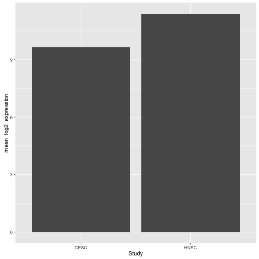

# Working with barcode lists

As part of working with the ISB-CGC web app, you will have created cohorts, represented by lists
of barcodes. This short tutorial shows how to retrieve your cohorts, query for sample details,
and compose a BigQuery, all from within the R environment.

The isb-cgc project has a collection of web services called 'endpoints', which accept
and return information. The endpoints allow the user to interact with the isb-cgc system programmatically,
or for a client application to do so on behalf of the user.

The ISBCGCExamples package contains a number of "wrapper" functions, that make calling
the endpoints possible from the R environment. These are just examples, and much
more is possible. See the documentation to get more ideas:

http://isb-cancer-genomics-cloud.readthedocs.io/en/latest/sections/progapi/Programmatic-API.html#isb-cgc-api

To get started, we load up R, and import the ISBCGCExamples library.


```r
library(ISBCGCExamples)
library(bigrquery)
```

### Creating a token

The first step is creating a token. This token contains your authentication
status, and lets the service know about what information is available to you.


```r
my_token <- isb_init()
```

Calling the isb_init function is going to open a browser window that lets you
authenticate with Google.

### Listing cohorts

To get a listing of the previously created cohorts, we can use the list_cohorts
function that takes a token, and returns a list with items including 'count',
'items', 'kind', and 'etag'. The count shows the number of saved cohorts and
the items contains information about the cohorts.


```r
my_cohorts <- list_cohorts(my_token)
names(my_cohorts)
```

```
## [1] "count" "items" "kind"  "etag"
```

If there is a count of four, then the my_cohorts$items list will have length four.
Each item has a name. We can use the lapply function (list-apply) to get the
names out of each list element.


```r
lapply(my_cohorts$items, function(x) x$name)
```

```
## [[1]]
## [1] "All TCGA Data"
## 
## [[2]]
## [1] "brain_age_10_to_39"
## 
## [[3]]
## [1] "new_cohort"
## 
## [[4]]
## [1] "HPV_cohort"
```

Also, importantly, each element in 'items' has an 'id', which is used when we
do further queries on the cohort.


```r
lapply(my_cohorts$items, function(x) x$id)
```

```
## [[1]]
## [1] "1"
## 
## [[2]]
## [1] "69"
## 
## [[3]]
## [1] "106"
## 
## [[4]]
## [1] "403"
```

### Getting barcode lists from a cohorts

Now that we have the cohort IDs, we can collect the various barcodes contained
in the cohort. These include patient barcodes, sample barcodes, and platform
specific aliquot barcodes. To do this, we can use the barcodes_from_cohort function.


```r
my_cohort_id <- lapply(my_cohorts$items, function(x) x$id)[[4]]
my_barcodes <- barcodes_from_cohort(my_cohort_id, my_token)
names(my_barcodes)
```

```
## [1] "cohort_id"     "patients"      "sample_count"  "patient_count"
## [5] "samples"       "kind"          "etag"
```

The object returned from barcodes_from_cohort is again a list, this time with
elements 'cohort_id', 'sample_count', 'patient_count', 'patients', and 'samples'.
The patients and samples elements are also lists, but lists of patients or
sample barcodes.


```r
my_barcodes$patients[1:5]
```

```
## [[1]]
## [1] "TCGA-2W-A8YY"
## 
## [[2]]
## [1] "TCGA-4J-AA1J"
## 
## [[3]]
## [1] "TCGA-4P-AA8J"
## 
## [[4]]
## [1] "TCGA-BA-4074"
## 
## [[5]]
## [1] "TCGA-BA-4075"
```

```r
my_barcodes$samples[1:5]
```

```
## [[1]]
## [1] "TCGA-2W-A8YY-01A"
## 
## [[2]]
## [1] "TCGA-4J-AA1J-01A"
## 
## [[3]]
## [1] "TCGA-4P-AA8J-01A"
## 
## [[4]]
## [1] "TCGA-BA-4074-01A"
## 
## [[5]]
## [1] "TCGA-BA-4075-01A"
```

### Getting details on a sample

Suppose you have a particular sample of interest. We can use the endpoints to
get details about the sample.


```r
my_sample_barcode <- my_barcodes$samples[1]
my_sample_details <- sample_details(a_sample_barcode)

names(my_sample_details)
```

```
## [1] "data_details"       "patient"            "data_details_count"
## [4] "aliquots"           "biospecimen_data"   "kind"              
## [7] "etag"
```

```r
my_sample_details$data_details_count
```

```
## [1] "18"
```

```r
length(my_sample_details$data_details)
```

```
## [1] 18
```

Here the data_details_count list element tells us that there are 18 "data details"
which contain information like data platforms, file names, paths to cloud storage,
the TCGA data level.

For example, let's see what platforms are represented.


```r
lapply(my_sample_details$data_details, function(x) x$Platform)
```

```
## [[1]]
## [1] "IlluminaHiSeq_RNASeqV2"
## 
## [[2]]
## [1] "IlluminaHiSeq_None"
## 
## [[3]]
## [1] "IlluminaHiSeq_DNASeq"
## 
## [[4]]
## [1] "MDA_RPPA_Core"
## 
## [[5]]
## [1] "HumanMethylation450"
## 
## [[6]]
## [1] "IlluminaHiSeq_RNASeqV2"
## 
## [[7]]
## [1] "IlluminaHiSeq_RNASeqV2"
## 
## [[8]]
## [1] "Genome_Wide_SNP_6"
## 
## [[9]]
## [1] "IlluminaHiSeq_miRNASeq"
## 
## [[10]]
## [1] "IlluminaHiSeq_miRNASeq"
## 
## [[11]]
## [1] "IlluminaHiSeq_RNASeqV2"
## 
## [[12]]
## [1] "IlluminaHiSeq_RNASeqV2"
## 
## [[13]]
## [1] "IlluminaHiSeq_RNASeq"
## 
## [[14]]
## [1] "IlluminaHiSeq_RNASeqV2"
## 
## [[15]]
## [1] "IlluminaHiSeq_RNASeqV2"
## 
## [[16]]
## [1] "IlluminaHiSeq_miRNASeq"
## 
## [[17]]
## [1] "Genome_Wide_SNP_6"
## 
## [[18]]
## [1] "Genome_Wide_SNP_6"
```

So we see that some platforms are listed more than once. What's the difference?
If we bring in the data type, we can see some differences.


```r
lapply(my_sample_details$data_details, function(x) paste(x$Platform, "__", x$Datatype))[6:7]
```

```
## [[1]]
## [1] "IlluminaHiSeq_RNASeqV2 __ exon_quantification"
## 
## [[2]]
## [1] "IlluminaHiSeq_RNASeqV2 __ RSEM_isoforms"
```

So, for example, list elements 6 and 7 are both IlluminaHiSeq_RNASeqV2 but
one represents exon_quantification while the other represents RSEM_isoforms.
The file names and cloud storage locations are found within the lists of each.

### Moving from the endpoints API to BigQuery

If we have a list of barcodes, then we can programmatically construct a BigQuery.

First let's flatten the list of sample barcodes to a character vector.


```r
# get the character vector of samples
samples <- unlist(my_barcodes$samples)

# SQL strings need to be surrounded by single quotes
samples_with_quotes <- sapply(samples, function(x) paste("'",x,"'", sep=""))

# then the samples need to be surrounded by parenthesis.
query_samples <- paste("( ", paste(samples_with_quotes, collapse=","), " )")

bq <- paste("
SELECT
   Study,
   AVG(LOG2(normalized_count+1)) as mean_log2_expression
FROM
   [isb-cgc:tcga_201510_alpha.mRNA_UNC_HiSeq_RSEM]
WHERE
   HGNC_gene_symbol = 'EGFR' AND
   SampleBarcode IN ", query_samples,"
GROUP BY
   Study"
)

results <- query_exec(bq, project)
results
```

```
##   Study mean_log2_expression
## 1  CESC             9.631475
## 2  HNSC            11.394739
```

At this point, if this is your first query, a browser window will pop-up, and
you will need to authenticate for BigQuery.

Since we're working in R, we can take advantage of the great visualization libraries.


```r
ggplot(data=results, aes(x=Study, y=mean_log2_expression)) + geom_bar(stat="identity")
```



### Wrap up

To reiterate, using the endpoints API, we got the list of previously created cohorts, retrieved the
list of sample barcodes, examined data associated with the samples, and constructed
a BigQuery.

More information on the endpoints API and R package example functions can be found at:

http://isb-cancer-genomics-cloud.readthedocs.io/en/latest/sections/progapi/Programmatic-API.html#isb-cgc-api

https://github.com/Gibbsdavidl/examples-R/blob/master/inst/doc/Working_With_Barcode_Lists.md


```r
sessionInfo()
```

```
## R version 3.2.4 (2016-03-10)
## Platform: x86_64-apple-darwin13.4.0 (64-bit)
## Running under: OS X 10.11.5 (El Capitan)
## 
## locale:
## [1] en_US.UTF-8/en_US.UTF-8/en_US.UTF-8/C/en_US.UTF-8/en_US.UTF-8
## 
## attached base packages:
## [1] stats     graphics  grDevices utils     datasets  methods   base     
## 
## other attached packages:
## [1] knitr_1.13           ggplot2_2.1.0        httr_1.1.0          
## [4] bigrquery_0.2.0      ISBCGCExamples_0.1.1
## 
## loaded via a namespace (and not attached):
##  [1] Rcpp_0.12.5      magrittr_1.5     munsell_0.4.3    colorspace_1.2-6
##  [5] R6_2.1.2         stringr_1.0.0    plyr_1.8.3       dplyr_0.4.3     
##  [9] tools_3.2.4      parallel_3.2.4   grid_3.2.4       gtable_0.2.0    
## [13] DBI_0.4-1        openssl_0.9.4    assertthat_0.1   formatR_1.4     
## [17] curl_0.9.7       evaluate_0.9     labeling_0.3     stringi_1.1.1   
## [21] scales_0.4.0     jsonlite_0.9.21  httpuv_1.3.3     markdown_0.7.7
```
