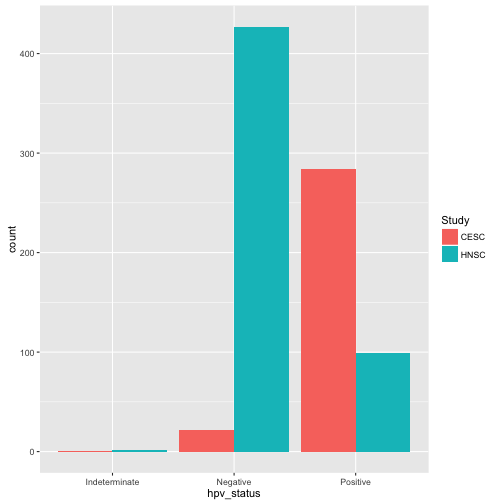
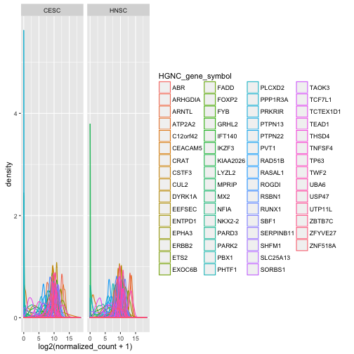
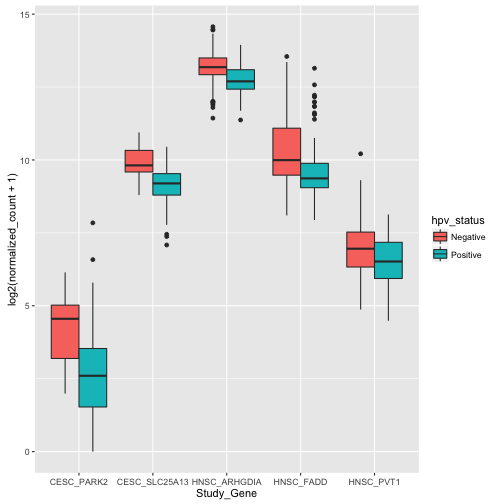

In this example, we will study the effect of HPV integration on the expression of recurrent target genes in CESC and HNSC tumors.
This example demonstrates using R to issue BigQuery queries involving multiple tables across multiple data sets. We will also show users
how to bring in their own data to use in conjunction with the TCGA data already available as BigQuery tables. In this exercise,
we will reproduce some figures from Tang et. al. [1] to visualize altered expression of host genes frequently targeted by HPV.

References:
1. Tang et. al. The landscape of viral expression and host gene fusion and adaptation in human cancer. Nature Communications 4, Article number:2513|doi:10.1038/ncomms3513

-------------------------------------------------------------------------

## Analysis workflow

Let's get started then! Let's first load all the required libraries and initialize all global variables

```r
require(bigrquery,quietly = TRUE) || install.packages('bigrquery',verbose = FALSE)
```

```
## [1] TRUE
```

```r
require(tidyr,quietly = TRUE) || install.packages('tidyr',verbose = FALSE)
```

```
## [1] TRUE
```

```r
require(dplyr,quietly = TRUE) || install.packages('dplyr',verbose = FALSE)
```

```
## [1] TRUE
```

```r
require(ggplot2,quietly = TRUE) || install.packages('ggplot2',verbose = FALSE)
```

```
## [1] TRUE
```

```r
require(broom,quietly = TRUE) || install.packages('broom',verbose = FALSE)
```

```
## [1] TRUE
```

Specify cloud project name(s)

```r
#cloud_project_workshop = "your project"
```

Specify BigQuery datasets you want to work with

```r
tcga_ds = "tcga_201510_alpha"
workshop_ds = "workspace"
```

First let's make sure everything is workign and list tables in the TCGA dataset.


```r
bigrquery::list_tables("isb-cgc", "tcga_201510_alpha")
```

```
##  [1] "Annotations"            "Biospecimen_data"      
##  [3] "Clinical_data"          "Copy_Number_segments"  
##  [5] "DNA_Methylation_betas"  "Protein_RPPA_data"     
##  [7] "Somatic_Mutation_calls" "mRNA_BCGSC_HiSeq_RPKM" 
##  [9] "mRNA_UNC_HiSeq_RSEM"    "miRNA_expression"
```

Tables we will be using in this example...


```r
clinical_table = "[isb-cgc:tcga_201510_alpha.Clinical_data]"
gexp_table     = "[isb-cgc:tcga_201510_alpha.mRNA_UNC_HiSeq_RSEM]"
ncomms_gene_table = "[isb-cgc:workshop.ncomms3513_s3]"
```

In this analysis, we are going to be looking at two studies.


```r
study=c('CESC','HNSC')
```

Now, let's gather the relevant data from BigQuery

1. Get all CESC and HNSC samples and their hpv status from clinical data

```r
# this is an example of building queries programmatically.

sqlQuery = paste("SELECT ParticipantBarcode, Study, hpv_calls, hpv_status ",
                 "FROM ", clinical_table,
                 " WHERE Study in (",paste(shQuote(study),collapse = ','),")",sep="")

sqlQuery
```

```
## [1] "SELECT ParticipantBarcode, Study, hpv_calls, hpv_status FROM [isb-cgc:tcga_201510_alpha.Clinical_data] WHERE Study in ('CESC','HNSC')"
```

```r
hpv_table = query_exec(sqlQuery,project = cloud_project_workshop)

dim(hpv_table)
```

```
## [1] 836   4
```

```r
head(hpv_table)
```

```
##   ParticipantBarcode Study hpv_calls hpv_status
## 1       TCGA-ZJ-AAXB  CESC     HPV18   Positive
## 2       TCGA-HD-A6HZ  HNSC      <NA>   Negative
## 3       TCGA-CQ-5330  HNSC      <NA>   Negative
## 4       TCGA-CQ-5331  HNSC      <NA>   Negative
## 5       TCGA-CQ-5332  HNSC      <NA>   Negative
## 6       TCGA-CQ-5333  HNSC      <NA>   Negative
```

```r
# We can do some quality control ...
# Assert that if hpv_calls is NA, hpv_status is Negative
stopifnot((is.na(hpv_table$hpv_calls) && hpv_table$hpv_status=="Negative") || !is.na(hpv_table$hpv_calls))

# Let's explore the cohort
ggplot(data=hpv_table, aes(x=hpv_status, fill=Study)) + geom_bar(stat="count", position=position_dodge())
```

```
## Warning: Removed 1 rows containing non-finite values (stat_count).
```



2. TCGA data or BBT analysis does not give us the location of HPV integration into host sequences,
So we'll get a list of frequently targeted genes published with this paper:
Ka-Wei Tang et. al. The Landscape of viral expression and host gene fusion and adaptation in human cancer. doi:10.1038/ncomms3513

(Supplementary Data 2: Integration analysis results)

We will access the data from our cloud bucket by either using the command line or from the browser.

Using the google command line tool:
gsutil cp gs://isb-cgc-workshop-data/ncomms3513-s3.tsv .
gsutil cp gs://isb-cgc-workshop-data/ncomms3513-s3_Schema.json .

Using the cloud console, go to https://console.cloud.google.com and find the
workshop bucket.

Then, to load the data into a BQ table, we use the 'bq' command. Make sure to change the table directory (the 'DG')!
bq load --source_format CSV --field_delimiter "\t"  --schema ncomms3513-s3_Schema.json  DG.ncomms3513_s3 ncomms3513-s3.tsv

Now we can directly query 'our' own data, and start to combine it with other tables.


```r
sqlQuery = "
SELECT
  Overlapping_genes,
  Cancer
FROM
  [isb-cgc-02-0001:DG.ncomms3513_s3]
WHERE
  Cancer IN ('CESC',
    'HNSC')
  AND Overlapping_genes <> 'Intergenic'
GROUP BY
  Cancer,
  Overlapping_genes
  "

affected_genes = query_exec(sqlQuery,project = cloud_project_workshop)

head(affected_genes)
```

```
##   Overlapping_genes Cancer
## 1             PARD3   CESC
## 2            RAD51B   CESC
## 3         LINC00393   CESC
## 4            ENTPD1   CESC
## 5            SORBS1   CESC
## 6             ERBB2   CESC
```

```r
table(affected_genes$Cancer)
```

```
## 
## CESC HNSC 
##   57   24
```
3. Now, we want to get gene expression data for affected_genes for the tumor types they are affected in


```r
sqlQuery = "
SELECT
  ParticipantBarcode,
  SampleBarcode,
  Study,
  HGNC_gene_symbol,
  normalized_count
FROM
  [isb-cgc:tcga_201510_alpha.mRNA_UNC_HiSeq_RSEM]
WHERE
  Study IN ('CESC','HNSC')
  AND SampleTypeLetterCode = 'TP'
  AND HGNC_gene_symbol IN (
  SELECT
    Overlapping_genes as HGNC_gene_symbol
  FROM
    [isb-cgc-04-0030:workspace.ncomms3513_s3]
  WHERE
    Cancer IN ('CESC','HNSC')
    AND Overlapping_genes <> 'Intergenic'
  GROUP BY
    HGNC_gene_symbol )
"

gexp_affected_genes = query_exec(sqlQuery,project = cloud_project_workshop)
```

```
## 
Retrieving data:  2.9s
Retrieving data:  4.1s
Retrieving data:  5.4s
Retrieving data:  6.7s
```

```r
#view results
head(gexp_affected_genes)
```

```
##   ParticipantBarcode    SampleBarcode Study HGNC_gene_symbol
## 1       TCGA-LP-A5U2 TCGA-LP-A5U2-01A  CESC             PVT1
## 2       TCGA-DS-A7WH TCGA-DS-A7WH-01A  CESC            PHTF1
## 3       TCGA-VS-A94W TCGA-VS-A94W-01A  CESC             CRAT
## 4       TCGA-VS-A9UD TCGA-VS-A9UD-01A  CESC          ARHGDIA
## 5       TCGA-VS-A9UD TCGA-VS-A9UD-01A  CESC            PHTF1
## 6       TCGA-VS-A9UD TCGA-VS-A9UD-01A  CESC            THSD4
##   normalized_count
## 1         401.6754
## 2         498.2336
## 3         489.7087
## 4        7266.6667
## 5         347.3684
## 6         115.7895
```

```r
# a couple different ways to look at the results
#qplot(data=gexp_affected_genes, x=Study, y=normalized_count, col=HGNC_gene_symbol, geom="boxplot")
#qplot(data=gexp_affected_genes, x=Study, y=log2(normalized_count), col=HGNC_gene_symbol, geom="boxplot")
qplot(data=gexp_affected_genes, x=log2(normalized_count+1), col=HGNC_gene_symbol, geom="density") + facet_wrap(~ Study)
```



Not all samples listed in the clinical data have gene expression data.
Let's filter the hpv_table to match the samples to those in gexp_affected_genes


```r
# let's get rid of 'indeterminate' samples
hpv_table = dplyr::filter(hpv_table, hpv_status != "Indeterminate", ParticipantBarcode %in% gexp_affected_genes$ParticipantBarcode)
```

Then, we are going to use a couple nice libraries to perform t.tests on expression by hpv_status


```r
gxps <- merge(x=gexp_affected_genes, y=hpv_table, by=c("Study","ParticipantBarcode"))

# Performing a t-test between hpv+ and hpv- by study and gene
res0 <- gxps %>%
group_by(Study, HGNC_gene_symbol) %>%
do(tidy(t.test(log2(normalized_count+1) ~ hpv_status, data=.))) %>%
ungroup() %>%
arrange(desc(statistic))

# These are the top 5 results ...
top5 <- select(top_n(res0, 5, statistic), Study, HGNC_gene_symbol)

# Let's subset the data by the top 5 results...
res1 <- merge(x=top5, y=gxps) %>% mutate( Study_Gene = paste0(Study, "_", HGNC_gene_symbol))

# now we can plot the results...
ggplot(res1, aes(x=Study_Gene, y=log2(normalized_count+1), fill=hpv_status)) + geom_boxplot()
```



## Making BigQueries

Now, we previously downloaded data, and performed some work on it. But another way
is to perform as much work as possible in the cloud, and use R to visualize summary results.

First we will compute some statistics on gene expression data.


"SELECT ParticipantBarcode, Study, hpv_calls, hpv_status FROM [isb-cgc:tcga_201510_alpha.Clinical_data] WHERE Study in ('CESC','HNSC')"


```r
sqlQuery = "
SELECT
  ParticipantBarcode,
  SampleBarcode,
  Study,
  HGNC_gene_symbol,
  normalized_count
FROM
  [isb-cgc:tcga_201510_alpha.mRNA_UNC_HiSeq_RSEM]
WHERE
  Study = 'CESC'
  AND SampleTypeLetterCode = 'TP'
  AND ParticipantBarcode IN (
  SELECT
    ParticipantBarcode
  FROM
    [isb-cgc:tcga_201510_alpha.Clinical_data]
  WHERE
    hpv_status = 'Positive' )
  AND HGNC_gene_symbol IN (
  SELECT
    Overlapping_genes AS HGNC_gene_symbol
  FROM
    [isb-cgc-04-0030:workspace.ncomms3513_s3]
  WHERE
    Cancer = 'CESC'
    AND Overlapping_genes <> 'Intergenic'
  GROUP BY
    HGNC_gene_symbol )
"
q1 = query_exec(sqlQuery,project = cloud_project_workshop)
dim(q1)
```

```
## [1] 12788     5
```

Now lets make a small change, and get gene expression for subjects that are
hpv negative.


```r
sqlQuery = "
SELECT
  ParticipantBarcode,
  SampleBarcode,
  Study,
  HGNC_gene_symbol,
  normalized_count
FROM
  [isb-cgc:tcga_201510_alpha.mRNA_UNC_HiSeq_RSEM]
WHERE
  Study = 'CESC'
  AND SampleTypeLetterCode = 'TP'
  AND ParticipantBarcode IN (
  SELECT
    ParticipantBarcode
  FROM
    [isb-cgc:tcga_201510_alpha.Clinical_data]
  WHERE
    hpv_status = 'Negative' )
  AND HGNC_gene_symbol IN (
  SELECT
    Overlapping_genes AS HGNC_gene_symbol
  FROM
    [isb-cgc-04-0030:workspace.ncomms3513_s3]
  WHERE
    Cancer = 'CESC'
    AND Overlapping_genes <> 'Intergenic'
  GROUP BY
    HGNC_gene_symbol )
"

q2 <- query_exec(sqlQuery,project = cloud_project_workshop)
dim(q2)
```

```
## [1] 1012    5
```

Now we will merge the previous two queries.


```r
q <- "
SELECT
  p.HGNC_gene_symbol AS gene,
  p.study AS study,
  p.x AS x,
  p.sx2 AS sx2,
  p.nx AS nx,
  o.y AS y,
  o.sy2 AS sy2,
  o.ny AS ny,
  (p.x-o.y) / SQRT((p.sx2/p.nx) + (o.sy2/o.ny)) AS T
FROM (
  SELECT
    Study,
    HGNC_gene_symbol,
    AVG(LOG2(normalized_count+1)) AS y,
    POW(STDDEV(LOG2(normalized_count+1)),2) AS sy2,
    COUNT(ParticipantBarcode) AS ny
  FROM
    [isb-cgc:tcga_201510_alpha.mRNA_UNC_HiSeq_RSEM]
  WHERE
    Study = 'CESC'
    AND SampleTypeLetterCode = 'TP'
    AND ParticipantBarcode IN (
    SELECT
      ParticipantBarcode
    FROM
      [isb-cgc:tcga_201510_alpha.Clinical_data]
    WHERE
      hpv_status = 'Positive' )
    AND HGNC_gene_symbol IN (
    SELECT
      Overlapping_genes AS HGNC_gene_symbol
    FROM
      [isb-cgc-04-0030:workspace.ncomms3513_s3]
    WHERE
      Overlapping_genes <> 'Intergenic'
    GROUP BY
      HGNC_gene_symbol )
  GROUP BY
    Study,
    HGNC_gene_symbol) AS o
JOIN (
  SELECT
    Study,
    HGNC_gene_symbol,
    AVG(LOG2(normalized_count+1)) AS x,
    POW(STDDEV(LOG2(normalized_count+1)),2) AS sx2,
    COUNT(ParticipantBarcode) AS nx
  FROM
    [isb-cgc:tcga_201510_alpha.mRNA_UNC_HiSeq_RSEM]
  WHERE
    Study = 'CESC'
    AND SampleTypeLetterCode = 'TP'
    AND ParticipantBarcode IN (
    SELECT
      ParticipantBarcode
    FROM
      [isb-cgc:tcga_201510_alpha.Clinical_data]
    WHERE
      hpv_status = 'Negative' )
    AND HGNC_gene_symbol IN (
    SELECT
      Overlapping_genes AS HGNC_gene_symbol
    FROM
      [isb-cgc-04-0030:workspace.ncomms3513_s3]
    WHERE
      Overlapping_genes <> 'Intergenic'
    GROUP BY
      HGNC_gene_symbol )
  GROUP BY
    Study,
    HGNC_gene_symbol) AS p
ON
  p.HGNC_gene_symbol = o.HGNC_gene_symbol
  AND p.Study = o.Study
GROUP BY
  gene,
  Study,
  x,
  sx2,
  nx,
  y,
  sy2,
  ny,
  T
 ORDER BY
   T DESC
 "

 t_test_result <- query_exec(q, project = cloud_project_workshop)
 head(t_test_result)
```

```
##       gene study          x       sx2 nx           y       sy2  ny
## 1 SLC25A13  CESC  9.9283278 0.3590735 22  9.14074081 0.3285980 278
## 2    PARK2  CESC  4.1823147 1.4849699 22  2.60244239 1.9296945 278
## 3    LYZL2  CESC  0.6856162 0.9468921 22  0.06497542 0.1986825 278
## 4      FN1  CESC 13.3765360 2.6274166 22 12.30562588 4.3118563 278
## 5  ZFYVE27  CESC  9.5155227 0.2626931 22  9.22055009 0.2510592 278
## 6   SORBS1  CESC  7.9819563 3.2584187 22  6.97101326 1.7923449 278
##          T
## 1 5.952998
## 2 5.790537
## 3 2.967053
## 4 2.915314
## 5 2.602776
## 6 2.571473
```

```r
# and we can see the same results in the previously done work.
 res0
```

```
## Source: local data frame [124 x 10]
## 
##    Study HGNC_gene_symbol  estimate estimate1 estimate2 statistic
##    (chr)            (chr)     (dbl)     (dbl)     (dbl)     (dbl)
## 1   HNSC          ARHGDIA 0.4407019 13.192626 12.751924  7.785298
## 2   CESC         SLC25A13 0.7875870  9.928328  9.140741  5.952998
## 3   CESC            PARK2 1.5798723  4.182315  2.602442  5.790537
## 4   HNSC             FADD 0.6987540 10.396622  9.697868  5.580469
## 5   HNSC             PVT1 0.4646509  6.967682  6.503031  4.626126
## 6   HNSC            USP47 0.2503863 10.730698 10.480312  4.354326
## 7   HNSC            THSD4 0.6199920  9.294742  8.674750  4.041557
## 8   HNSC         TCTEX1D1 0.4535760  2.980775  2.527199  3.560172
## 9   HNSC         SLC25A13 0.1996817  9.471745  9.272063  3.305995
## 10  HNSC             UBA6 0.2549797 10.959532 10.704552  3.134546
## ..   ...              ...       ...       ...       ...       ...
## Variables not shown: p.value (dbl), parameter (dbl), conf.low (dbl),
##   conf.high (dbl)
```

## Extras

Transform gexp_affected_genes_df into a gexp-by-samples feature matrix


```r
gexp_fm = tidyr::spread(gexp_affected_genes,HGNC_gene_symbol,normalized_count)
gexp_fm[1:5,1:5]
```

```
##   ParticipantBarcode    SampleBarcode Study       ABR   ARHGDIA
## 1       TCGA-2W-A8YY TCGA-2W-A8YY-01A  CESC 2686.3376  4843.348
## 2       TCGA-4J-AA1J TCGA-4J-AA1J-01A  CESC  954.2930  3237.078
## 3       TCGA-4P-AA8J TCGA-4P-AA8J-01A  HNSC 2304.1134 13927.592
## 4       TCGA-BA-4074 TCGA-BA-4074-01A  HNSC  882.9095  6667.874
## 5       TCGA-BA-4076 TCGA-BA-4076-01A  HNSC 3513.0526  5507.543
```


```r
# ng-chm

#library(NGCHM)
#library(ISBCHM)
#library(magrittr)
# NOTE: ip address of the NGCHM server is hard coded. Make usre it's the correct
#       one by checking the VM instance on the Google Cloud Console.
#chmCreateManagedServer('cloud','ng-chm','104.154.59.99')
#options(cloudproject='isb-cgc')

#chm= exprCHM('GEXP_Hpv Status',study,getStudyCohort(study),affected_genes_df[,],
#'Comparison of mRNA expression levels between HPV positive and HPV negative CESC samples')

#exprCHM() from ISBCHM ends here    
#plot(chm)
```
